|  | Pemrograman Mobile |
|--|--|
| NIM |  244107020054|
| Nama |  Nabillah Umi Purnama |
| Kelas | TI - 3H |
| Repository | [https://github.com/nabillahumi/244107020054-mobile-course] () |

# WEEK 1
## Declarative UI & Responsive Design

Berikut merupakan hasil running:

### Halaman 3 (DEMO)

*1. Jalankan aplikasi hasil akhir pada emulator ukuran ponsel (misal 5"), lalu tablet (misal 10"); bandingkan jumlah kolomnya.*

##### Pada layar ponsel :

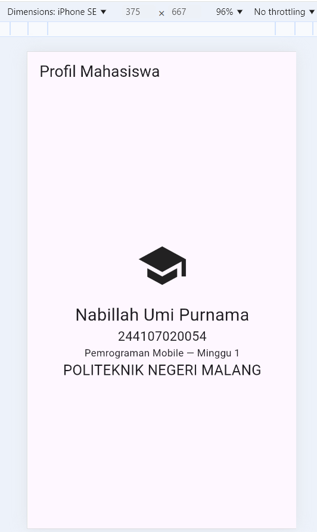

##### Pada layar tablet :

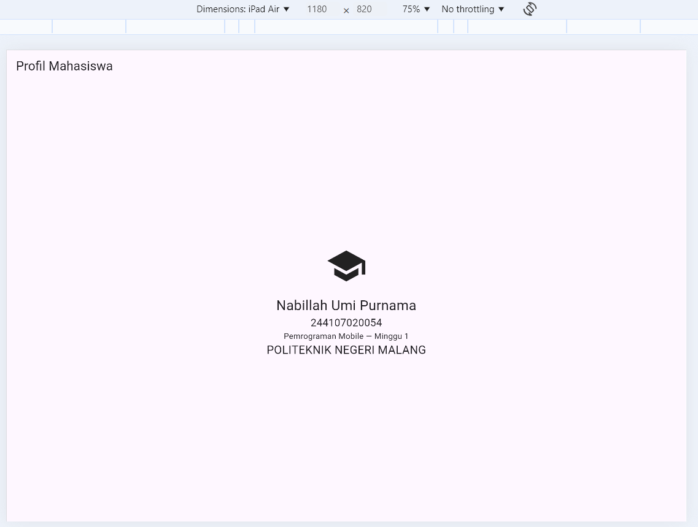

Pada layar ponsel, tampilan dashboard menggunakan satu kolom, sedangkan pada layar tablet menggunakan dua kolom. Perbedaan tersebut menunjukkan bahwa layout aplikasi dapat menyesuaikan ukuran layar secara responsif.

*2. Aktifkan dark mode pada emulator/perangkat dan amati perubahan tema secara otomatis.*

##### Mode gelap :

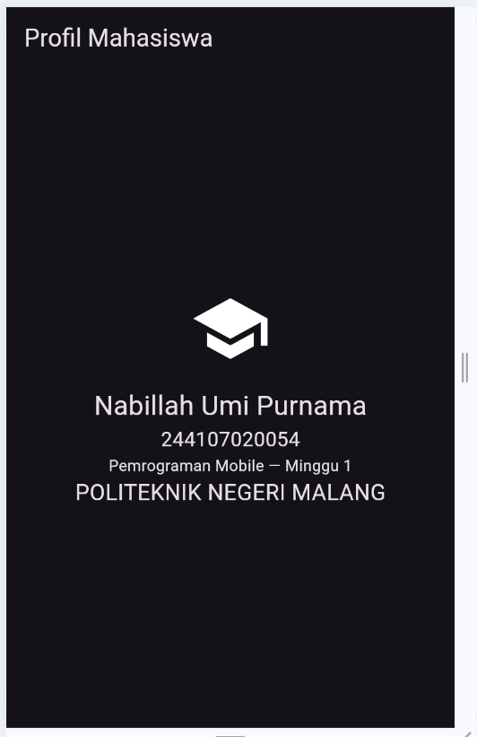

##### Kode :

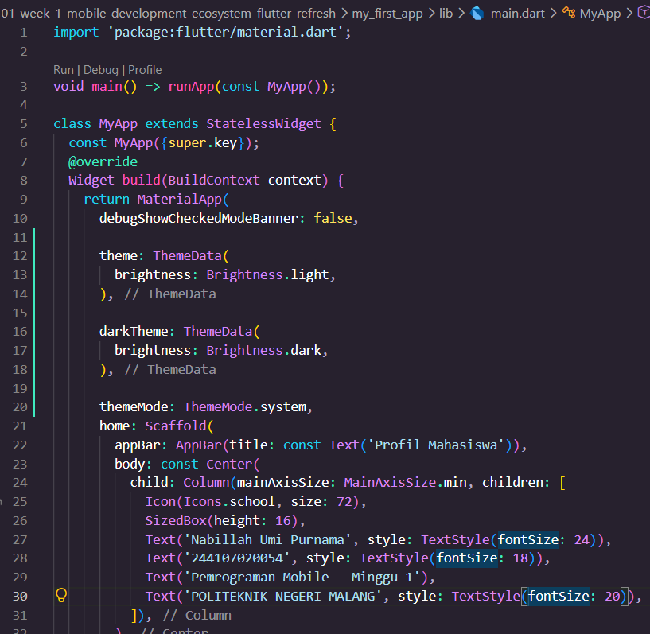

Ketika dark mode diaktifkan, tampilan aplikasi secara otomatis berubah menjadi tema gelap. Hal ini terjadi karena aplikasi menggunakan darkTheme dan ThemeMode.system, sehingga tema mengikuti pengaturan sistem perangkat.

*3. Perhatikan pola declarative: UI tidak diubah satu per satu, hanya state yang diperbarui dan Flutter membangun ulang tampilan.*

Flutter menggunakan konsep Declarative UI ($UI = f(state)$). Artinya, kita tidak perlu mengedit properti elemen UI satu per satu secara manual saat terjadi perubahan kondisi. Cukup perbarui kondisi/konfigurasinya (seperti tema sistem), maka Flutter akan otomatis membangun ulang (rebuild) seluruh tampilan sesuai kondisi terbaru.

### Halaman 4 (Praktikum: layout sederhana (warm-up))

*1. Hapus Expanded pada baris nama, lalu amati peringatan overflow atau perilaku layout-nya; kembalikan setelah itu.*

##### Tampilan awal :

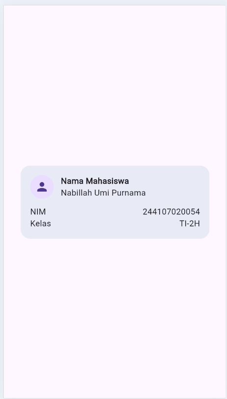

##### Tampilan dengan expanded (saya tambah teks) :

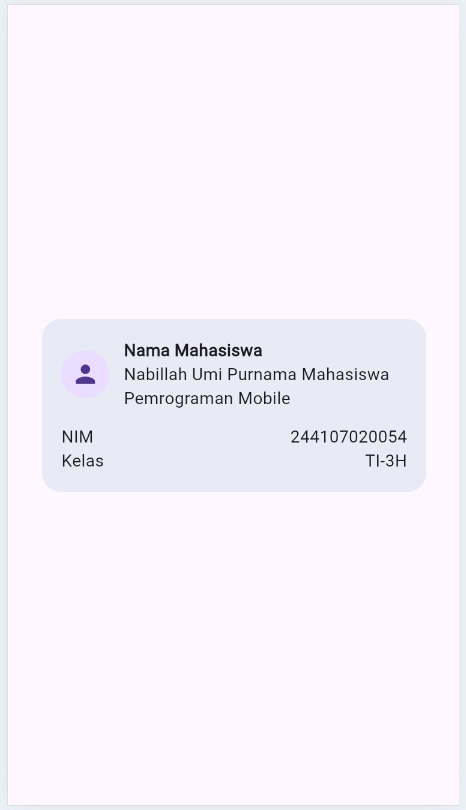

##### Tampilan tanpa expanded : 

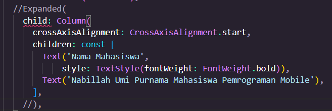

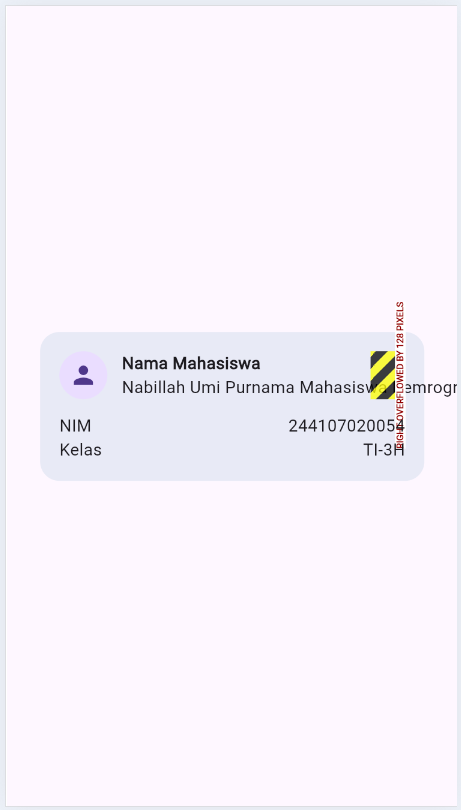

Saya menambahkan beberapa kata agar dapat melihat perbedaan dengan expanded dan tanpa expanded. Jadi setelah Expanded dihapus, Column tidak lagi menggunakan ruang yang tersedia secara fleksibel. Hal ini dapat menyebabkan perubahan posisi atau overflow apabila ruang horizontal tidak mencukupi. 

*2. Ganti mainAxisSize: MainAxisSize.min menjadi nilai default dan amati perubahan tinggi kartu.*

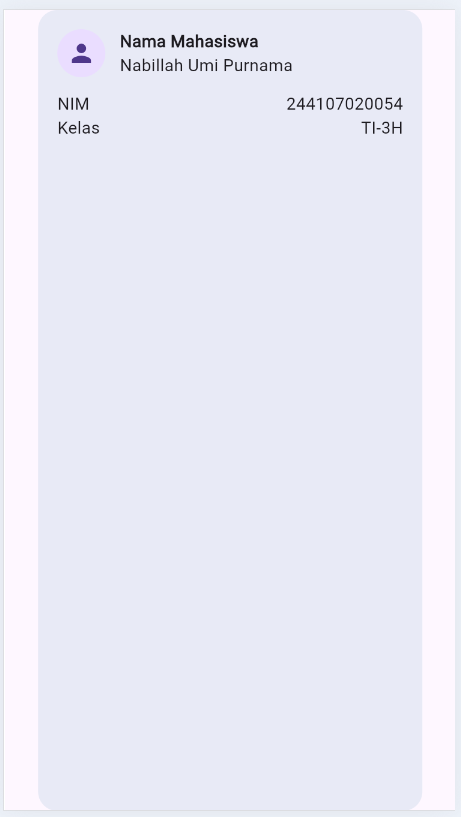

Setelah mainAxisSize: MainAxisSize.min diganti mainAxisSize: MainAxisSize.max, Column menggunakan nilai default yaitu MainAxisSize.max. Akibatnya, Column mengambil ruang vertikal yang tersedia sehingga tinggi kartu dapat menjadi lebih besar dibandingkan saat menggunakan MainAxisSize.min

*3.Tambahkan satu baris data (misal Email) menggunakan pola Row + Expanded yang sama.*

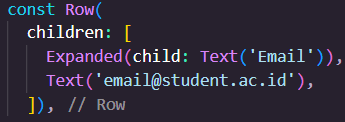

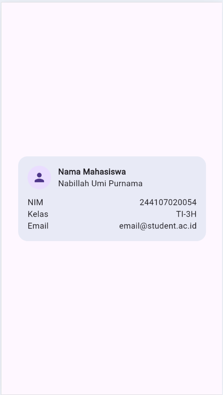

### Halaman 5 (dashboard responsif)

##### Tampilan awal :

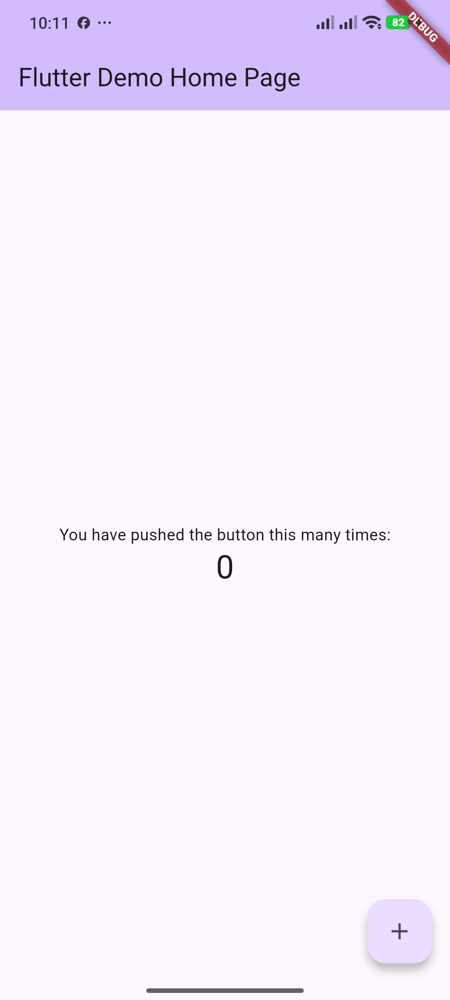

##### Tampilan setelah di ubah :

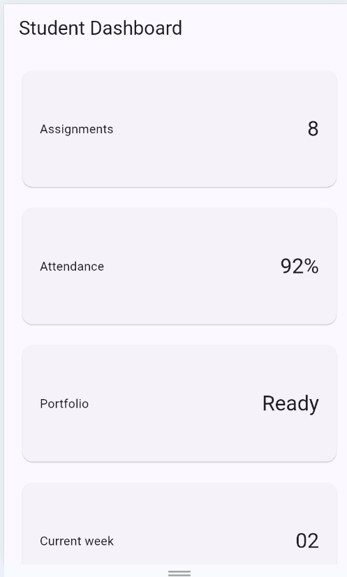

##### Tampilan setelah Menambahkan interaksi: StatefulWidget dan Cupertino

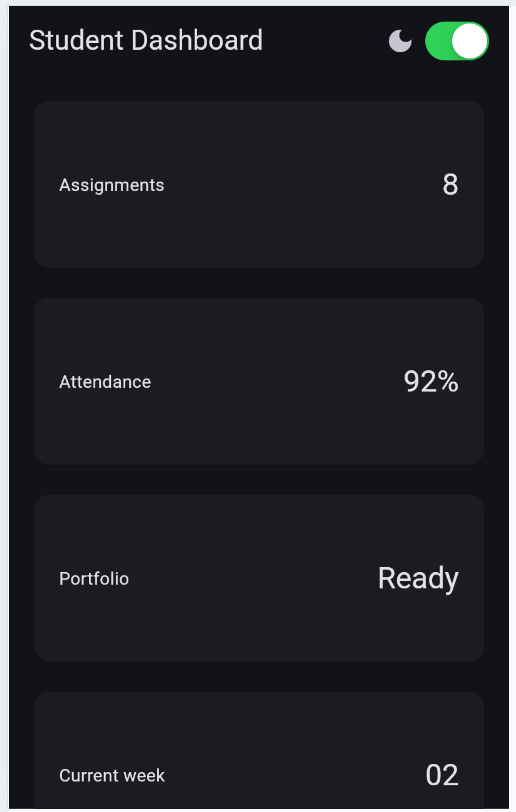

Tampilan dapat diiubah menjadi model gelap dan terang

*1. Ubah breakpoint dari 700 menjadi nilai lain dan amati perubahan jumlah kolom.*

##### Ubah menjadi 300

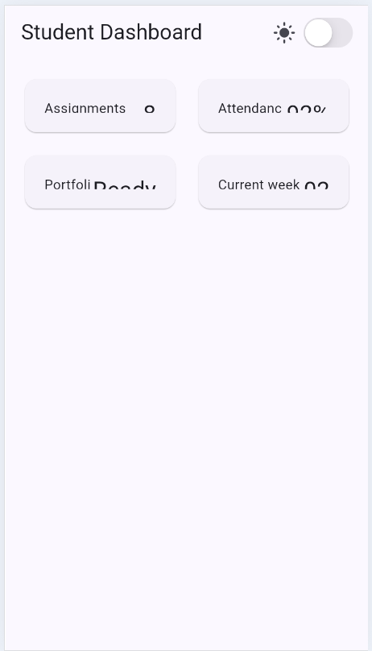

Saya coba ubah dari 700 menjadi 500 dan 400, tetapi tampilan pada HP tetap menggunakan 1 kolom karena lebar layar masih lebih kecil dari breakpoint. Saat breakpoint saya ubah menjadi 300, tampilan berubah menjadi 2 kolom karena lebar layar sudah memenuhi kondisi breakpoint. 

*2. Ubah themeMode menjadi ThemeMode.dark, lalu kembalikan ke ThemeMode.system.*

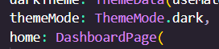

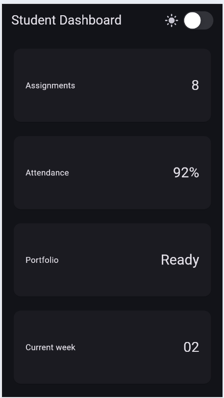

ThemeMode diubah menjadi ThemeMode.dark. Hasilnya, aplikasi langsung menggunakan tema gelap meskipun pengaturan perangkat menggunakan mode terang. 

*3.Uji aplikasi dengan ukuran layar emulator yang berbeda.*

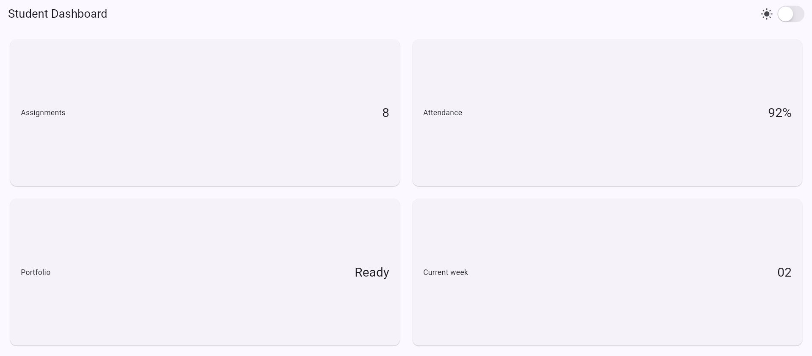

Pada layar HP yang lebih kecil, dashboard menampilkan 1 kolom. Saat diuji pada layar yang lebih besar, dashboard menampilkan 2 kolom. Hal ini menunjukkan bahwa aplikasi dapat menyesuaikan tampilan berdasarkan ukuran layar.

*4.Tambahkan Semantics atau label yang bermakna pada elemen yang penting bagi screen reader.*

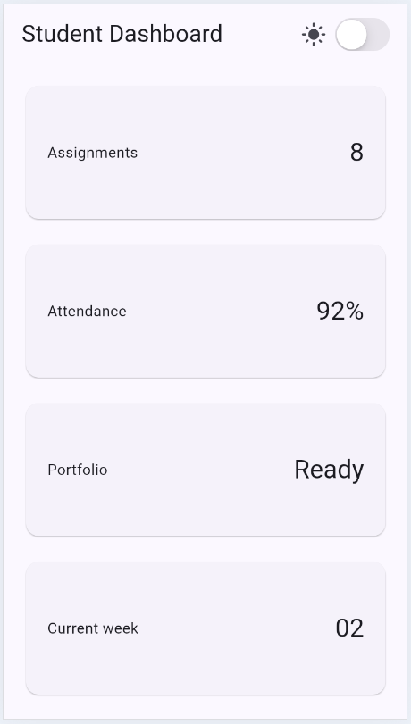

Pada percobaan ini ditambahkan Semantics pada setiap dashboard card dengan label yang menggabungkan nama dan nilai, seperti “Assignments: 8”. Perubahan tidak terlihat pada tampilan aplikasi, tetapi Semantics membantu screen reader mengenali dan membacakan informasi pada card dengan lebih jelas.

### Halaman 6 (dashboard responsif)

#### Tugas utama

Kembangkan dashboard menjadi halaman Academic Overview dengan ketentuan:

*1. Memiliki header profil dan minimal empat kartu informasi.*

Header menampilkan informasi seperti nama, kelas, NIM,email.
Selain header, dashboard memiliki empat kartu informasi, yaitu:

Assignments → menampilkan jumlah tugas.

Attendance → menampilkan persentase kehadiran.

Portfolio → menunjukkan status portfolio.

Current Week → menunjukkan minggu perkuliahan saat ini.

*2. Menggunakan Row, Column, Expanded, dan Container.*
- Row digunakan untuk menyusun widget secara horizontal.
- Column digunakan untuk menyusun informasi secara vertikal.
- Expanded digunakan supaya bagian informasi profil mengambil ruang yang tersedia setelah avatar.
- Container digunakan sebagai pembungkus header profil dan memberikan padding, warna latar belakang, serta bentuk sudut.
Kesimpulan: keempat widget yang diwajibkan digunakan dalam struktur layout dashboard.

*3. Menampilkan satu kolom pada layar sempit dan dua kolom pada layar lebar.*

##### Pada layar ponsel : 

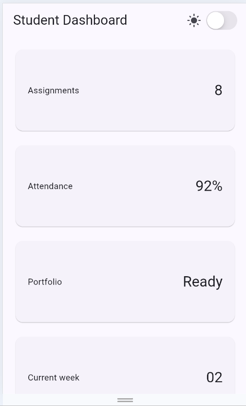

##### Pada layar tablet :

Dashboard dapat menyesuaikan susunan kartu berdasarkan ukuran layar sehingga tidak menggunakan layout yang sama untuk semua perangkat.

*4. Menyediakan light theme dan dark theme yang tetap terbaca, dengan toggle tema (misal CupertinoSwitch atau Switch.adaptive).*

##### Mode terang :

##### Mode gelap :

Aplikasi menyediakan light mode dan dark mode yang dapat diubah secara langsung melalui switch.

*5. Memiliki label aksesibilitas untuk informasi atau tombol penting.*

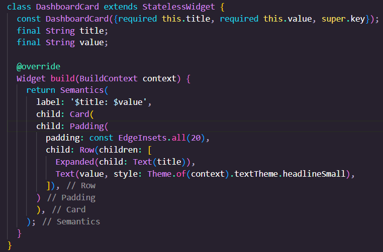

Informasi penting dan kontrol tema memiliki label yang bermakna sehingga meningkatkan aksesibilitas aplikasi.

*6. Menyertakan screenshot layar sempit dan lebar pada folder screenshots/.*

#### AI Prompt Challenge
*1. Prompt desain. Ajukan prompt ini (atau variasinya): "Bandingkan dua tata letak dashboard akademik untuk Flutter: versi GridView dan versi LayoutBuilder + Column. Jelaskan trade-off responsif dan aksesibilitasnya."*

- GridView digunakan ketika dashboard memiliki beberapa kartu dengan bentuk dan strukturnya relatif sama.
- LayoutBuilder digunakan untuk mengetahui seberapa besar ruang yang tersedia, kemudia Column digunakan untuk menyususn idget secara vertikal
- Untuk responsivitas, keduanya sama-sama baik
- Untuk aksesibilitas lebih bergantung pada bagaimana idget di dalam layout digunakan

##### Keputusan 

Saya lebih memilih kombinasi LayoutBuilder dan GridView karena dashboard memiliki beberapa kartu informasi dengan struktur yang sama. LayoutBuilder digunakan untuk menentukan jumlah kolom berdasarkan ukuran layar, sedangkan GridView digunakan untuk menyusun kartu. Pendekatan ini sederhana, responsif, dan tetap dapat mendukung accessibility menggunakan Semantics.

*2. Prompt penguatan konsep. "Jelaskan kapan penggunaan Expanded justru menyebabkan overflow di dalam Row, beri contoh kode yang gagal dan perbaikannya."*

Expanded digunakan untuk membuat sebuah widget mengisi ruang yang tersedia di dalam Row atau Column. Row tetap dapat mengalami overflow apabila salah satu widget di dalamnya membutuhkan ruang yang terlalu besar. Dalam contoh ini, masalah dapat terjadi apabila value memiliki teks yang sangat panjang karena Text(value) berada di luar Expanded.

Contoh yang berpotensi overflow:

    Row(
    
    children: [
    
        Expanded(
    
        child: Text(title),
    
        ),
    
        Text(
    
        'Nilai tugas mahasiswa yang sudah dikumpulkan dan sedang diperiksa',
    
        ),
    
    ],

    )

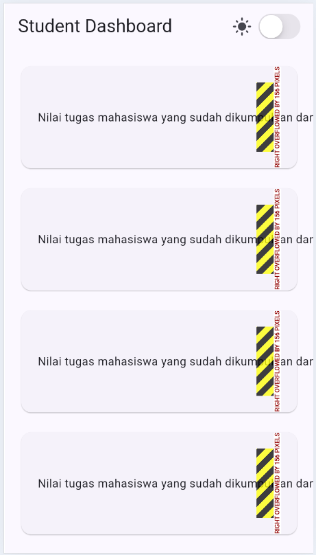

Jika ruang pada kartu terlalu sempit, teks value dapat membutuhkan ruang lebih besar daripada ruang yang tersedia sehingga muncul RenderFlex overflow pada Row.

Perbaikannya:

    Row(
    
    children: [
    
        Expanded(
    
        child: Text(
    
            'Nilai tugas mahasiswa yang sudah dikumpulkan dan sedang diperiksa',
    
        ),
    
        ),
    
    ],

    ),

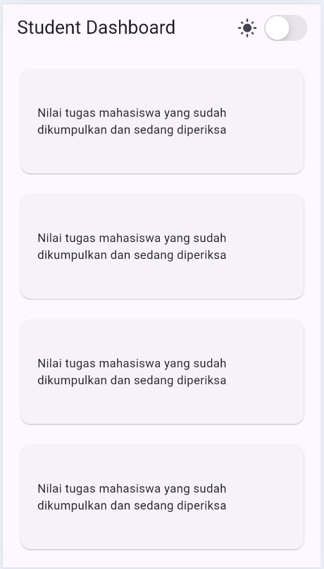

Dengan menggunakan Expanded pada kedua bagian, ruang yang tersedia dibagi antara title dan value. TextOverflow.ellipsis juga mencegah teks yang terlalu panjang keluar dari batas kartu.

##### Keputusan

Pada kode saya, penggunaan Expanded pada DashboardCard sudah sesuai karena Row berada di dalam Card yang memiliki batas lebar dari GridView.

*3. Verification prompt. Minta AI mengaudit hasilnya sendiri: "Periksa kembali rekomendasi layout di atas: apakah tetap responsif di bawah 600px, apakah mengurangi aksesibilitas, dan apakah ada widget yang tidak tersedia di Flutter stabil saat ini?"*

Responsif: di bawah 700px menggunakan 1 kolom, sehingga otomatis mencakup layar di bawah 600px.
Aksesibilitas: Semantics tetap digunakan pada setiap DashboardCard.
Kompatibilitas: widget yang digunakan (LayoutBuilder, GridView, Expanded, Semantics, Card, dan CupertinoSwitch) tersedia di Flutter.
Hasil pengujian: layout dapat berjalan tanpa overflow pada ukuran layar yang diuji.

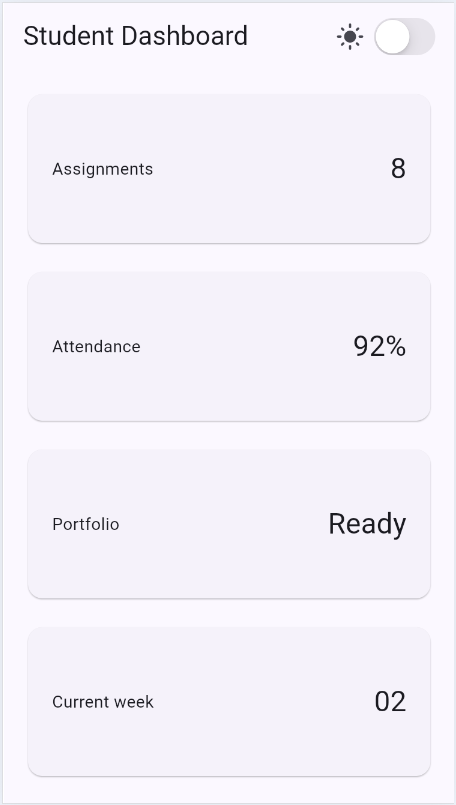

##### Keputusan
Saya tetap menggunakan kombinasi LayoutBuilder + GridView. Hasil verifikasi menunjukkan bahwa layout tetap responsif pada layar di bawah 600px dengan satu kolom, tetap mendukung aksesibilitas melalui Semantics, dan menggunakan widget yang tersedia pada Flutter.

#### Refactoring challenge

*1. Ekstrak kartu informasi menjadi widget reusable (misal InfoCard) yang menerima title dan value, sehingga tidak ada duplikasi widget.*

Saya menggunakan widget reusable DashboardCard yang menerima parameter title dan value. Widget ini digunakan untuk seluruh kartu informasi pada dashboard sehingga struktur kartu tidak perlu ditulis berulang kali. Dengan menggunakan DashboardCard, setiap kartu dapat menampilkan informasi yang berbeda hanya dengan mengubah nilai title dan value.

*2. Ganti warna dan ukuran yang di-hardcode dengan Theme.of(context) agar mengikuti tema terang/gelap secara otomatis.*

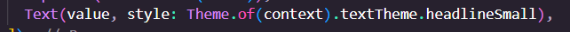

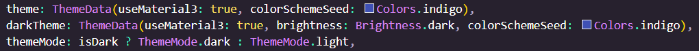

Dari awal implementasi kode sudah menggunakan ThemeData dan Theme.of(context). Jadinya tidak ada perubahan

*3. Pindahkan breakpoint ke satu konstanta bernama (misal const kWideBreakpoint = 700;) agar hanya didefinisikan satu kali.*

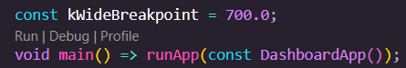

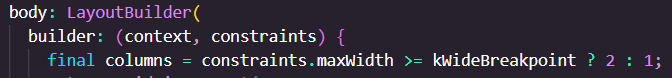

Melakukan perubahan dengan memindahkan nilai 700 ke konstanta kWideBreakpoint agar kode lebih mudah dipelihara dan tidak menggunakan nilai breakpoint secara langsung di dalam logika layout.

*4. Jalankan flutter analyze dan pastikan tidak ada error maupun warning baru.*

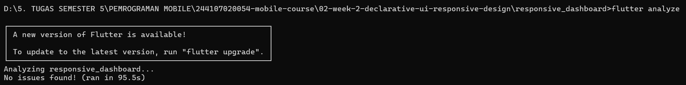

Refactoring dapat digunakan karena hasil flutter analyze menunjukkan tidak ada masalah pada kode.

#### Testing dasar

##### Hasil flutter test

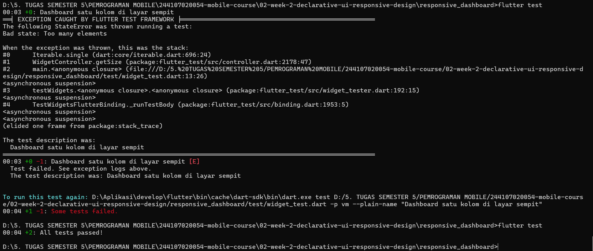

##### kode file test

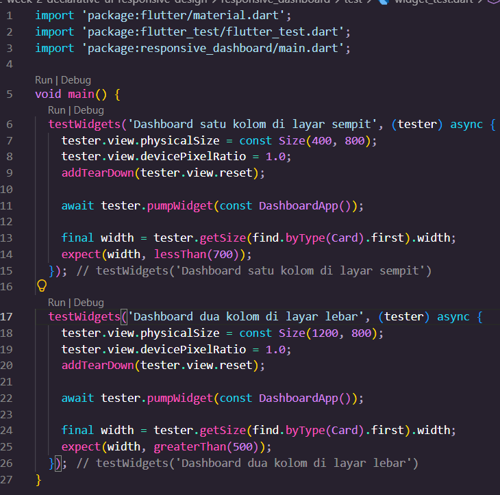

Testing dasar dilakukan untuk memastikan dashboard responsif pada layar sempit dan lebar. Hasil pengujian menunjukkan kedua test berhasil/lulus dengan hasil +2: All tests passed!.

#### Cheklist Verifikasi

[✓] flutter analyze tidak menghasilkan error.

[✓] flutter test lulus semua widget test responsif.

[✓] Aplikasi dapat dijalankan pada ukuran layar sempit dan lebar.

[✓] Dark mode memiliki kontras dan teks yang terbaca.

[✓] Struktur widget dapat dijelaskan saat code review.

[✓] Screenshot, folder test/, dan README sudah tersimpan pada folder tugas Week 2.

### Refleksi
##### 1. Apa perbedaan cara berpikir imperative dan declarative saat membangun UI?
Imperative mengatur langkah-langkah secara langsung, sedangkan declarative menjelaskan hasil UI yang diinginkan.

##### 2. Kapan Expanded membantu dan kapan penggunaannya justru menghasilkan layout error?
Membantu membagi ruang yang tersedia, tetapi dapat menyebabkan error jika digunakan pada kondisi layout yang tidak memiliki ruang terbatas.

##### 3. Bagaimana breakpoint dan theme memengaruhi pengalaman pengguna?
Breakpoint menyesuaikan tampilan dengan ukuran layar, sedangkan theme mengatur tampilan seperti warna dan dark mode agar nyaman digunakan.

##### 4. Apa yang Anda verifikasi dari rekomendasi AI setelah tugas inti selesai?
Saya memverifikasi rekomendasi AI dengan membandingkannya dengan hasil implementasi dan testing yang telah dilakukan.