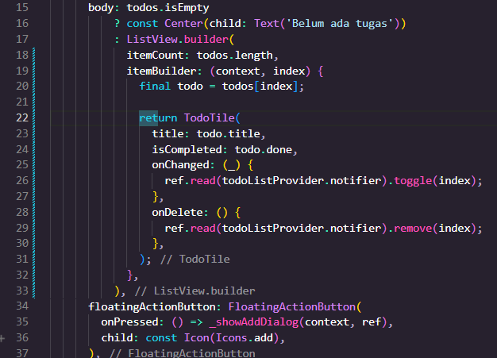
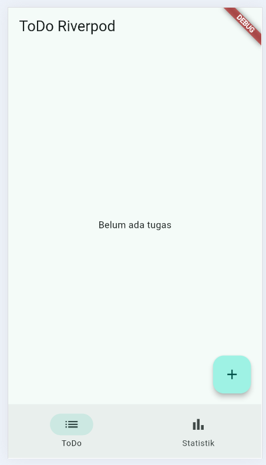
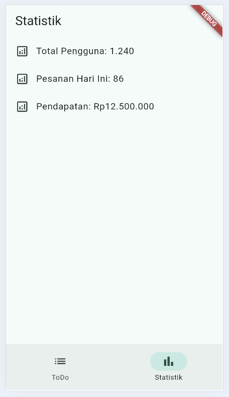
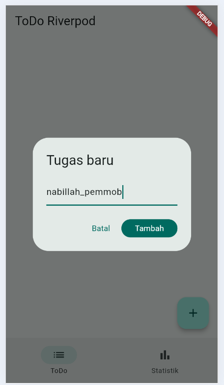
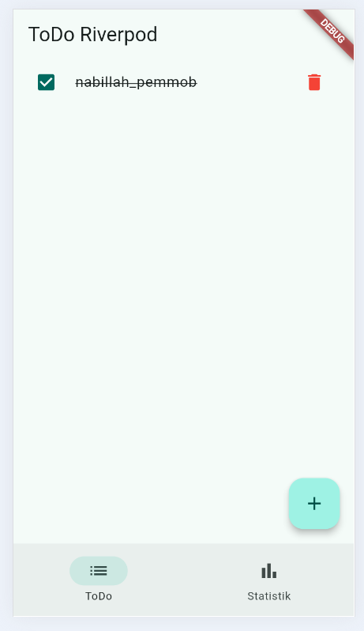
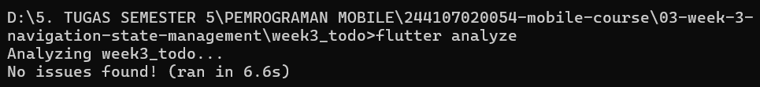
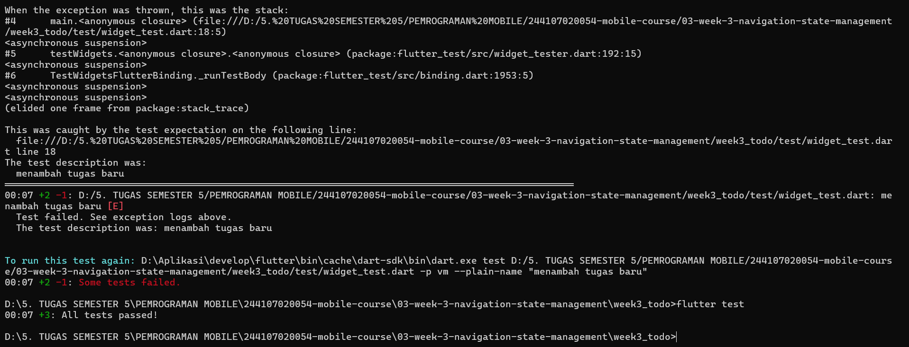

|  | Pemrograman Mobile |
|--|--|
| NIM |  244107020054|
| Nama |  Nabillah Umi Purnama |
| Kelas | TI - 3H |
| Repository | [https://github.com/nabillahumi/244107020054-mobile-course] () |

# WEEK 3
## Navigation & State Management

Berikut merupakan hasil running:

### Praktikum 1 - Aplikasi multi-page dengan GoRouter

#### Tampilan awal week_navigation:

#### Tampilan setelah diubah:

#### Tampilan per item:

### Praktikum 2 — Aplikasi ToDo dengan Riverpod

#### Tampilan awak week_todo

#### AsyncValue: loading, error, success

####  kode product_provider.dart

#### kode product_page.dart

#### susunan file

#### kode main.dart

#### Tampillan hasil AsyncValue

### Praktikum 3 — Uji ketiga state

*1. Salin kode di atas ke project ToDo Anda (atau project terpisah) dan jalankan. Amati tampilan loading selama 2 detik pertama.*

Aplikasi menampilkan loading selama 2 detik, kemudian menampilkan data Keyboard, Mouse, dan Monitor.

*2. Ubah build() sementara untuk melempar error: throw Exception('Gagal terhubung ke server');. Jalankan dan amati UI error beserta tombol Coba lagi.*

#### Kode gagal

#### Tampilan gagal

Setelah diberi Exception, aplikasi menampilkan pesan “Gagal terhubung ke server” dan tombol “Coba lagi”.

*3. Tekan tombol Coba lagi, ref.invalidate membuat provider dijalankan ulang. Pulihkan kode, pastikan state success tampil.*

ref.invalidate(productsProvider) menjalankan ulang provider. Setelah error diperbaiki, data produk kembali ditampilkan.

*4. Refleksikan: mengapa menampilkan ulang data lama (stale data) dengan indikator refresh kadang lebih baik daripada mengosongkan layar? Kapan pola itu penting?*

Stale data lebih baik karena data lama tetap terlihat saat data baru sedang dimuat, sehingga UI tidak kosong dan pengalaman pengguna lebih nyaman.

### AI Challenge

#### 1. AI Prompt Challenge

Buatkan halaman Flutter bernama StatsPage menggunakan flutter_riverpod.
Requirements:
- ConsumerWidget dengan satu AsyncNotifierProvider yang mensimulasikan
  pengambilan data statistik (delay 2 detik, kadang gagal 30%).
- UI harus menangani loading (spinner), error (pesan + tombol retry),
  dan success (ListView 3 item).
- Berikan unit test untuk notifier-nya.
Jelaskan setiap bagian kode dalam komentar.

##### stats_provider.dart

##### stats_page.dart

##### stats_provider_test.dart

##### main.dart

#### 2. AI Verification Checklist

Sebelum kode AI diterima, verifikasi hal berikut dan catat temuan Anda di README:

*[✓] Apakah state diubah secara immutable (tidak ada state.add() atau mutasi list langsung)?*

Iya, lolos. Karena pada StatsNotifier, state itu berupa hasil string dengan kode :

return [

  'Total Pengguna: 1.240',

  'Pesanan Hari Ini: 86',

  'Pendapatan: Rp12.500.000',

];

dan juga tidak menggunakan state.add(). Jadi state dikelola secara immutable dan tidak mutasi list secara langsung

*[✓] Apakah ref.watch hanya dipakai di dalam build, dan ref.read di callback?*

Iya, ref.watch hanya digunakan di dalam method build(), sedangkan ref.invalidate dipanggil di dalam callback onPressed.

*[✓] Apakah ketiga state AsyncValue benar-benar ditangani (bukan hanya success)?*

Iya, loading, error, dan success ditangani menggunakan when()

*[✓] Apakah provider dideklarasikan dengan tipe eksplisit dan tidak duplikat dengan provider lain?*

Iya, menggunakan AsyncNotifierProvider<StatsNotifier, List<String>> dan tidak duplikat dengan provider lain.

*[✓] Apakah kode AI memakai API Riverpod versi lama (StateProvider antipattern, StateNotifierProvider usang, atau Consumer bertingkat yang tidak perlu)? Perbaiki ke pola Notifier/ConsumerWidget.*

Tidak, kode menggunakan pola modern AsyncNotifier dan ConsumerWidget.

*[-] Jalankan flutter analyze dan flutter test, apakah hasil AI lolos tanpa warning?*

flutter analyze berhasil tanpa masalah, sedangkan flutter test awal menemukan masalah pada widget test dan asynchronous error test sehingga perlu diperbaiki dan diuji ulang.

#### 3. Perbaikan

Setelah melakukan verifikasi terhadap kode yang dihasilkan AI, ditemukan beberapa bagian pada kode testing yang perlu diperbaiki

1. Perbaikan unit test asynchronous
Pada stats_provider_test.dart, pengujian kondisi error awalnya menggunakan expect() secara langsung terhadap Future. Kode diperbaiki menggunakan await expectLater() agar test menunggu proses asynchronous sampai selesai sebelum memeriksa exception.
2. Penyesuaian widget test dengan Riverpod
Pada widget_test.dart, test bawaan Flutter tidak sesuai dengan aplikasi yang sudah menggunakan Riverpod. Test diperbaiki dengan menambahkan ProviderScope dan override statsProvider agar halaman StatsPage dapat diuji dengan kondisi yang terkontrol.
3. Verifikasi hasil testing
Setelah perbaikan dilakukan, kode diuji kembali menggunakan flutter analyze dan flutter test untuk memastikan tidak terdapat masalah pada kode maupun pengujian.

###### Hasil Perbaikan

#### flutter test

### Refactoring dan testing

#### 1. Refactoring Challenge

Lakukan refactoring berikut pada aplikasi ToDo Anda, lalu commit dengan pesan yang jelas:

1. Pisahkan widget bar ToDo menjadi TodoTile tersendiri agar build lebih pendek dan mudah diuji.

##### Kode todo_tile.dart

##### Tambahan kode todo_page.dart

##### Susunan file

2. Ekstrak logika filter (misal tampilkan hanya yang belum selesai) menjadi Provider turunan yang membaca todoListProvider.

##### Tambahan kode todo_provider.dart

3. Integrasikan aplikasi ToDo dengan GoRouter: / untuk daftar dan /stats untuk halaman statistik, tambahkan NavigationBar untuk berpindah.

#### 2. Testing

Widget test untuk memastikan UI bereaksi terhadap perubahan state provider:

##### flutter analyze

##### flutter test

Jalankan seluruh verifikasi:

#### 3. Checklist verifikasi mandiri

[✓] Navigasi GoRouter bekerja: pindah halaman, back, dan akses path detail langsung.

Navigasi berhasil berpindah antara halaman ToDo (`/`) dan Statistik (`/stats`) menggunakan NavigationBar. Path `/stats` juga dapat diakses secara langsung.

[✓] ProviderScope membungkus root aplikasi; state ToDo bertahan saat berpindah halaman.

`ProviderScope` ditempatkan pada root aplikasi sehingga seluruh halaman dapat menggunakan Riverpod dan state ToDo tetap tersimpan saat berpindah halaman.

[✓] UI AsyncValue menangani loading, error, dan success, bukan hanya success.

`StatsPage` menangani tiga kondisi menggunakan `when()`, yaitu menampilkan spinner saat loading, pesan dan tombol retry saat error, serta data statistik saat berhasil.

[✓]flutter analyze tanpa issue dan semua test lulus.

`flutter analyze` digunakan untuk memeriksa kode, sedangkan `flutter test` digunakan untuk memastikan seluruh pengujian berjalan dengan baik.

[✓] Hasil AI diverifikasi dan didokumentasikan pada folder docs/.

Prompt, hasil awal AI, serta proses verifikasi dan perbaikan telah didokumentasikan pada README.md.

### Tugas, refleksi, dan referensi

#### Mini project / Industry Challenge

Bangun aplikasi ToDo dengan navigasi dan Riverpod sebagai tugas minggu ini:

*1. Minimal 2 halaman dengan GoRouter: daftar tugas, halaman detail/statistik.*

*2. State dikelola Riverpod (Notifier), UI menggunakan ConsumerWidget.*

*3.Tambahkan fitur simulasi asinkron dengan AsyncValue: state loading, error, dan success tampil dengan benar.*

*4. Sertakan minimal 1 unit/widget test yang lulus.*

*5. Kerjakan bagian AI Challenge dan dokumentasikan prompt, hasil AI, perbaikan, serta alasan keputusan teknis Anda.*

*6. Push ke repository portfolio pada folder 03-week-3-navigation-state-management/ dengan struktur lib/, test/, README.md, dan screenshots/. README menjelaskan tujuan, fitur utama, stack teknologi, cara menjalankan, dan hasil yang dicapai.*

### Refleksi

*1. Kapan setState masih cukup, dan kapan state harus naik ke Riverpod?*

setState cocok untuk mengatur perubahan sederhana yang hanya digunakan dalam satu widget. Riverpod lebih sesuai jika state perlu digunakan oleh beberapa bagian aplikasi atau halaman.

*2. Apa perbedaan context.go dan context.push, dan kapan masing-masing tepat digunakan?*

context.go digunakan untuk berpindah langsung ke route tertentu, sedangkan context.push digunakan ketika ingin membuka halaman baru dan tetap bisa kembali ke halaman sebelumnya.

*3. Bagaimana AsyncValue mencegah bug dibanding tiga boolean terpisah?*

AsyncValue membuat status proses asynchronous lebih terstruktur karena kondisi loading, error, dan berhasil ditangani dalam satu state.

*4. Bagian mana dari hasil AI yang Anda perbaiki, dan mengapa?*

Saya menyesuaikan kode AI dengan struktur project yang sudah ada, terutama pada bagian provider, routing, dan testing agar tidak terjadi error saat flutter analyze dan flutter test.