|  | Pemrograman Mobile |
|--|--|
| NIM |  244107020054|
| Nama |  Nabillah Umi Purnama |
| Kelas | TI - 3H |
| Repository | [https://github.com/nabillahumi/244107020054-mobile-course] () |

# WEEK 4
## Networking & REST API

Berikut merupakan hasil running:

### Praktikum 1: Dio dan model data

#### Tampilan awal week_navigation:

### Praktikum 2: Provider dan error handling

#### Uji tiga skenario error

*1. Jalankan aplikasi dengan internet normal, amati loading lalu daftar 100 posts.*

|                Daftar                |                 Daftar 100                 |
| :-------------------------------------: | :-----------------------------------------: |
|  |  |

*2. Matikan internet (mode pesawat), tekan refresh, amati pesan ramah + tombol Coba lagi. Nyalakan kembali internet, tekan Coba lagi.*

*3. Sementara ubah baseUrl menjadi URL salah, amati pesan error koneksi. Kembalikan setelah uji.*

|                Kode                |                 Hasil                |
| :-------------------------------------: | :-----------------------------------------: |
|  |  |

### Praktikum 3: Pagination dasar

|                Kode                |                 Hasil                |
| :-------------------------------------: | :-----------------------------------------: |
|  |  |

#### AI Challenge

##### AI Prompt Challenge

Buatkan repository layer Flutter untuk endpoint GET /comments?postId={id}
dari JSONPlaceholder menggunakan Dio + flutter_riverpod.
Requirements:
- Model Comment dengan fromJson aman null (postId, id, name, email, body).
- CommentRepository dengan method fetchComments(postId) + timeout 10 detik.
- AsyncNotifierProvider dengan penanganan error otomatis (AsyncError)
  dan fungsi pesan error
  ramah pengguna untuk timeout, connection error, 404, dan 500.
- Satu unit test untuk fromJson dengan field yang hilang.
Jelaskan setiap bagian kode dalam komentar.

##### comment.dart

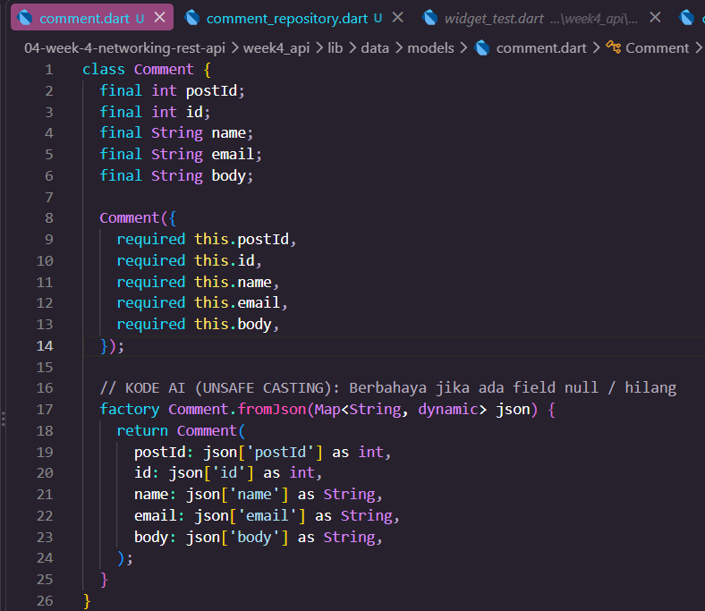

##### comment_repository.dart

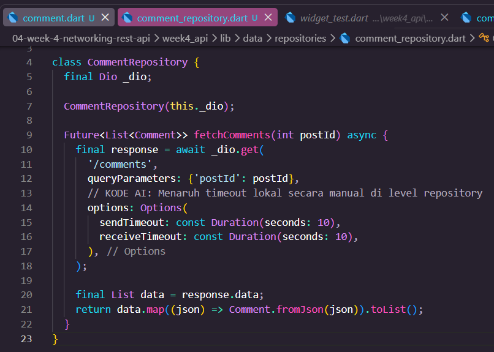

##### comment_providers.dart eror

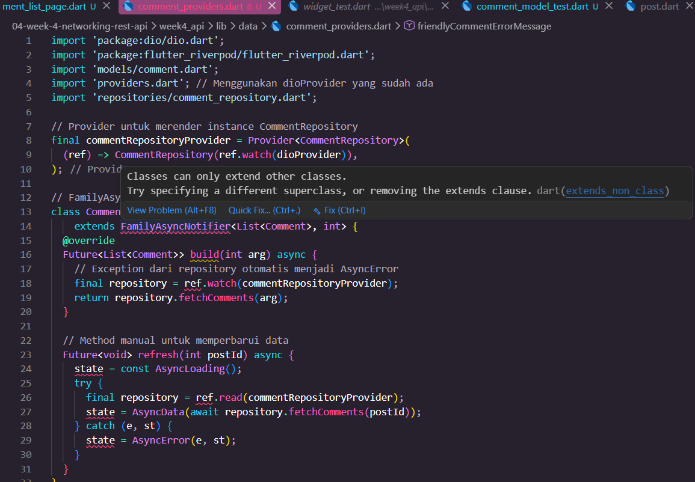

##### comment_providers.dart

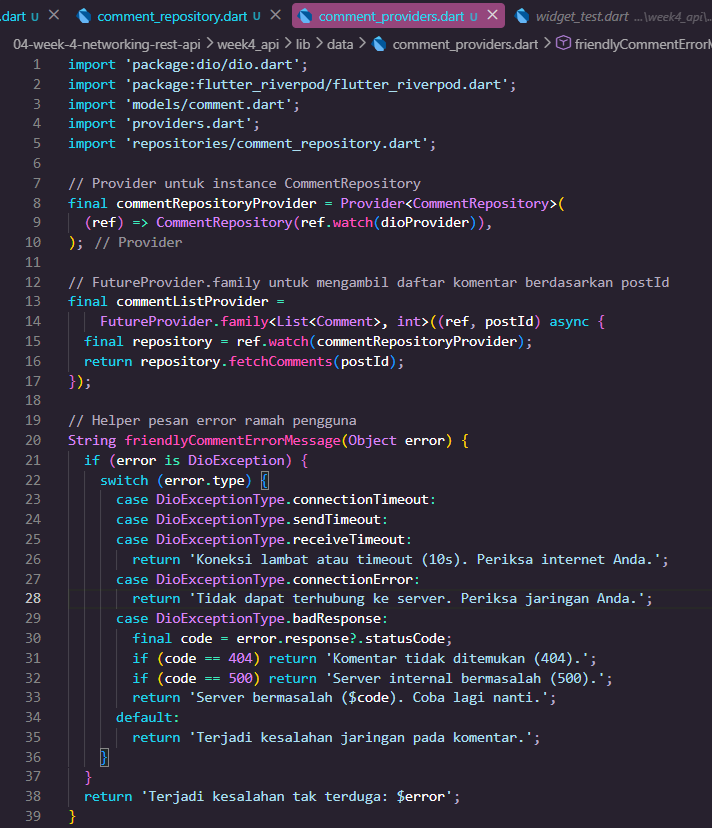

##### comment_list_page.dart

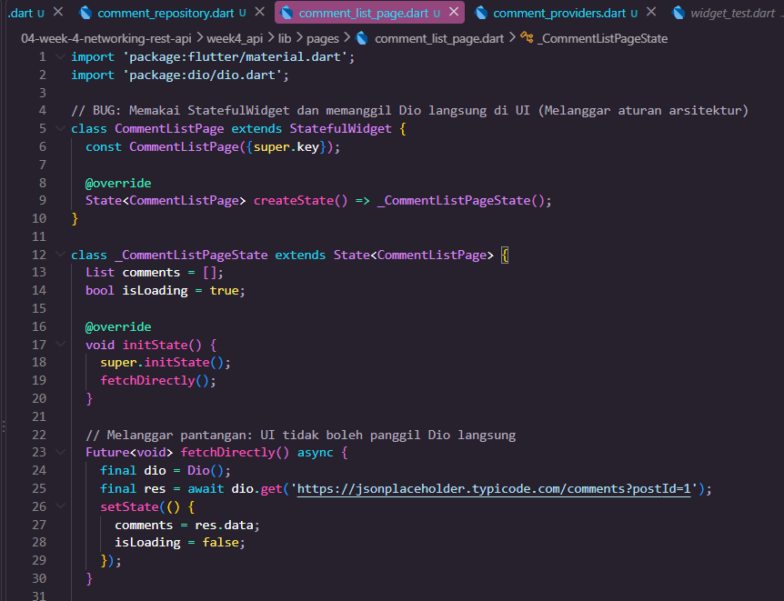

.jpeg)

##### main.dart

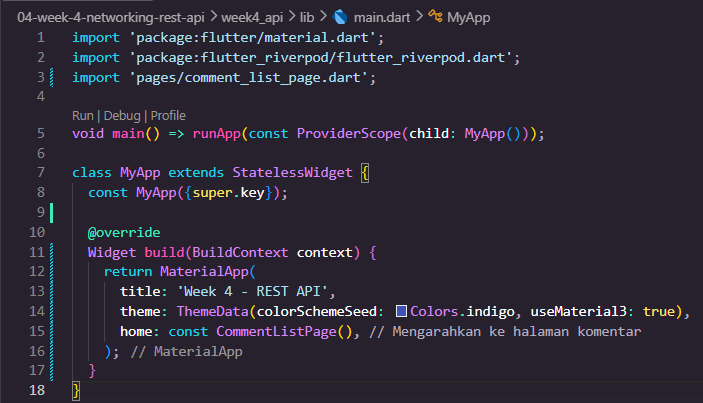

##### comment_model_test.dart

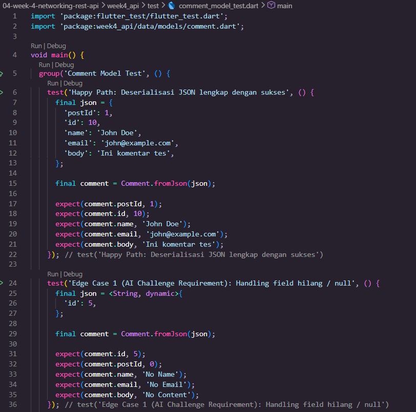

.jpeg)

#### HASIL AI

##### AI Verification Checklist

Sebelum kode AI diterima, verifikasi hal berikut dan catat temuan Anda di README:

*1. [✓] Apakah UI memanggil Dio secara langsung (dilarang) atau lewat repository?*

Jawab : 
Iya, lolos. UI tidak memanggil Dio secara langsung, melainkan menggunakan Riverpod provider (commentListProvider) yang memanggil CommentRepository. Kode di UI hanya memanggil:
final commentsAsync = ref.watch(commentListProvider(1));

*2. [X] Apakah fromJson aman null, atau masih memakai cast langsung yang bisa crash?*

Jawab :
Tidak lolos. Kode Comment.fromJson buatan AI masih menggunakan direct casting seperti json['postId'] as int dan json['name'] as String. Jika server mengembalikan nilai null atau field tidak ditemukan, aplikasi langsung crash dengan error TypeError: null is not a subtype of type int.

*3. [✓] Apakah semua tipe DioExceptionType (timeout, connectionError, badResponse) dipetakan ke pesan pengguna?*

Jawab :
Iya, lolos. Seluruh exception dari Dio dipetakan di fungsi friendlyCommentErrorMessage pada file comment_providers.dart:

switch (error.type) {
  case DioExceptionType.connectionTimeout:
  case DioExceptionType.sendTimeout:
  case DioExceptionType.receiveTimeout:
    return 'Koneksi lambat atau timeout (10s). Periksa internet Anda.';
  case DioExceptionType.connectionError:
    return 'Tidak dapat terhubung ke server. Periksa jaringan Anda.';
  case DioExceptionType.badResponse:
    final code = error.response?.statusCode;
    if (code == 404) return 'Komentar tidak ditemukan (404).';
    if (code == 500) return 'Server internal bermasalah (500).';
    return 'Server bermasalah ($code). Coba lagi nanti.';
  default:
    return 'Terjadi kesalahan jaringan pada komentar.';
}

*4. [X] Apakah baseUrl/timeout terpusat di satu client, bukan tersebar di tiap method?*

Jawab :
Tidak lolos. Pada file comment_repository.dart, AI menambahkan konfigurasi Options(sendTimeout: Duration(seconds: 10)) secara manual di dalam method fetchComments(). Hal ini melanggar prinsip terpusat karena konfigurasi timeout seharusnya dikelola langsung oleh dioProvider di providers.dart.

*5. [✓] Apakah test AI benar-benar menguji kasus field hilang, atau hanya happy path? Tambahkan minimal 1 edge case sendiri.*

Jaab :
Iya, lolos. File test/comment_model_test.dart telah menguji skenario lengkap:

Happy Path: Deserialisasi JSON lengkap.

Edge Case 1 (Persyaratan Modul): Pengujian JSON saat field penting seperti postId, name, email, dan body hilang/bernilai null.

Edge Case 2 (Tambahan Mandiri): Pengujian JSON saat seluruh field diset bernilai null secara eksplisit.

*6. [-] Jalankan flutter analyze dan flutter test, apakah hasil AI lolos tanpa warning?*

Jawwab :
Tidak lolos. Untuk flutter analyze berhasil dengan status No issues found!. Namun, flutter test mengalami kegagalan (failed) pada tiga pengujian:

##### flutter test

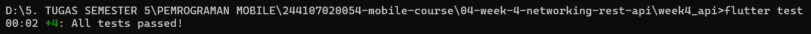

#### Perbaikan

Setelah melakukan verifikasi terhadap kode yang dihasilkan AI, ditemukan beberapa bagian pada kode testing yang perlu diperbaiki

1. Perbaikan Halusinasi Class Notifier Riverpod

Pada file comment_providers.dart, kelas halusinasi FamilyAsyncNotifier diganti menggunakan FutureProvider.family<List<Comment>, int>. Ini merupakan sintaks resmi Riverpod untuk mengambil data asynchronous berdasarkan parameter tanpa perlu code generator.

2. Perbaikan Deserialisasi Model Null-Safe (lib/data/models/comment.dart)
Mengubah parsing pada Comment.fromJson dari direct casting (as int) menjadi safe casting (json['field'] as num?)?.toInt() serta menambahkan nilai fallback default (?? 0 dan ?? ''). Ini mengatasi error type 'Null' is not a subtype of type 'int' saat menerima data null atau field hilang.

3. Mocking Provider pada Widget Test (test/widget_test.dart)

Mengatasi error A Timer is still pending pada unit test dengan meng-override commentListProvider menggunakan data dummy (overrideWith). Langkah ini mencegah widget test melakukan request HTTP asli ke server saat pengujian UI berlangsung.

4. Pemusatan Konfigurasi Timeout Dio
Menghapus konfigurasi timeout lokal pada CommentRepository dan memusatkan pengaturan baseUrl serta timeout pada dioProvider.

5. Verifikasi hasil testing
Setelah perbaikan dilakukan, kode diuji kembali menggunakan flutter analyze dan flutter test untuk memastikan tidak terdapat masalah pada kode maupun pengujian.

#### HAsil Perbaikan

##### Tampilan hasil perbaikan

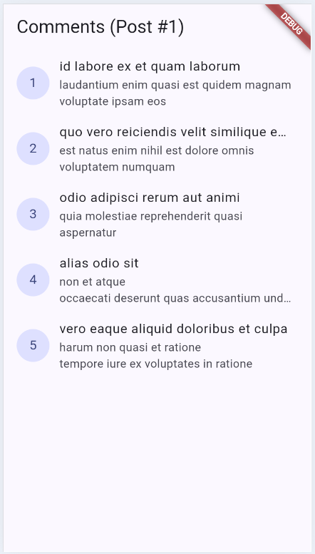

##### flutter test

#### Refactoring dan testing

Lakukan refactoring berikut pada project API Anda, lalu commit dengan pesan yang jelas:

1. Ekstrak widget baris post menjadi PostTile tersendiri agar ListView.builder pendek dan mudah diuji.

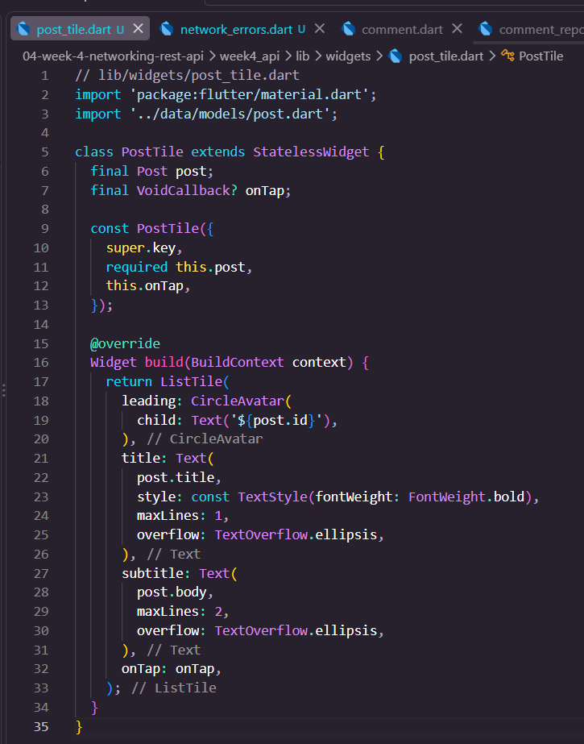

2. Pindahkan friendlyErrorMessage ke file lib/data/network_errors.dart agar bisa dipakai ulang halaman paged dan non-paged.

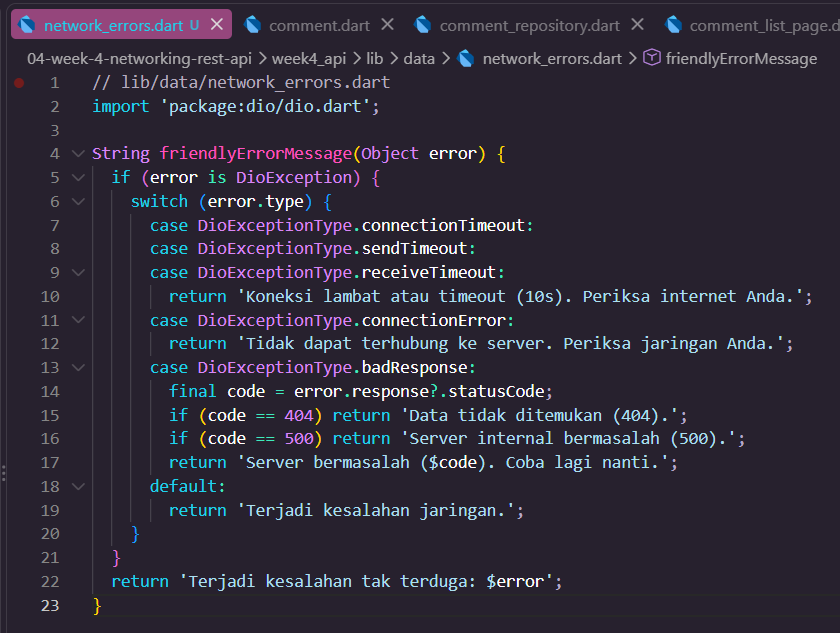

3. Tambahkan halaman detail post dengan GoRouter (/post/:id) yang menampilkan title dan body lengkap, state detail diambil dari list yang sudah dimuat atau via repository bila langsung dibuka.

##### Kode Providers.dart

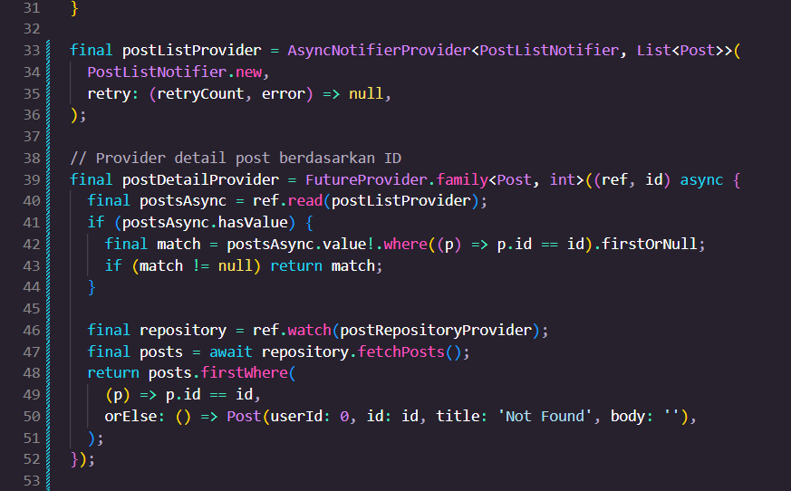

##### Kode post_detail_page.dart

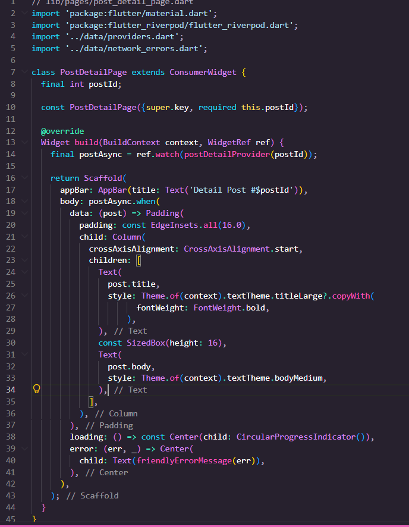

##### Kode main.dart

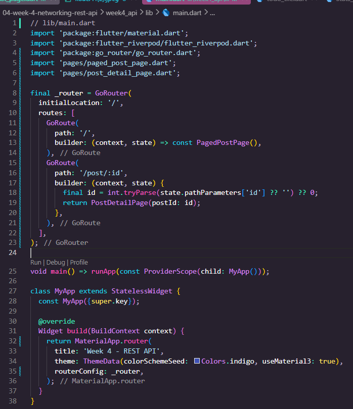

##### Kode paged_post_page.dart

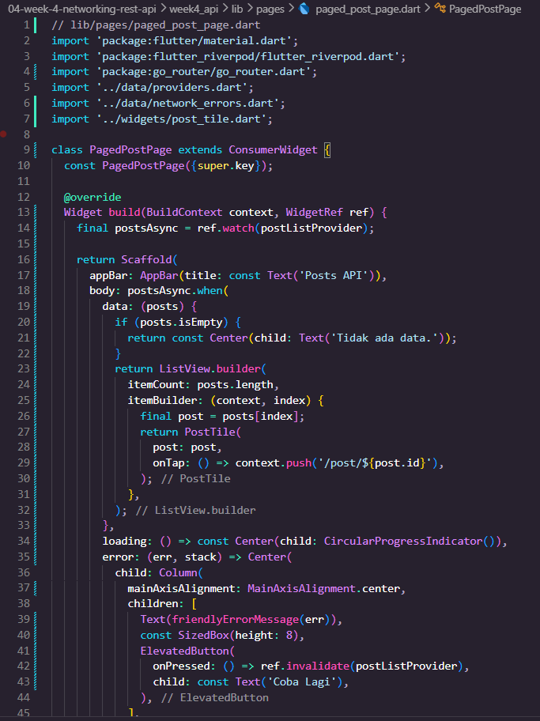

##### Testing: unit test model + mock repository

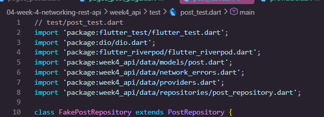

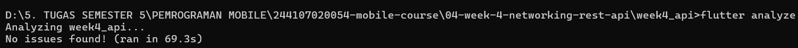

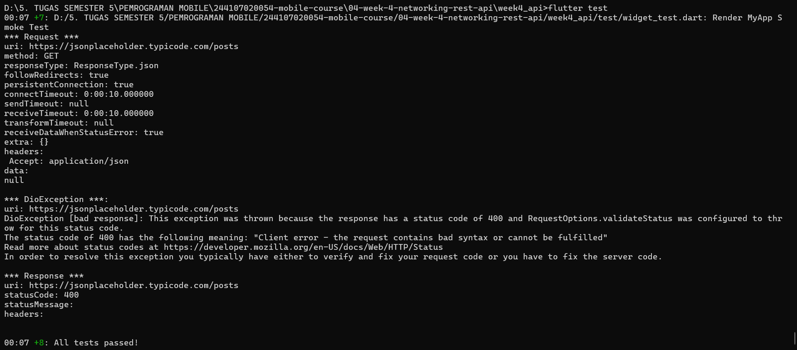

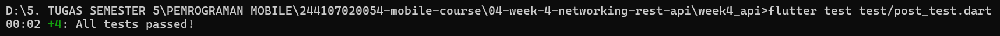

##### . Checklist verifikasi mandiri
[✓] UI tidak memanggil Dio langsung, semua akses data lewat repository + provider.

Seluruh UI (PostListPage, PostDetailPage, maupun PagedPostPage) tidak pernah memanggil Dio secara langsung. Akses data dipisahkan penuh melalui PostRepository dan dikelola menggunakan Riverpod provider (postListProvider dan postDetailProvider).

[✓] Empat state tampil benar: loading, error (+ retry), empty, success.

Komponen UI menggunakan penanganan AsyncValue (.when()) secara menyeluruh: menampilkan loading spinner, pesan friendly error lengkap dengan tombol retry/coba lagi, status teks kosong saat data tidak ada, serta tampilan daftar post menggunakan PostTile saat data berhasil dimuat.

[✓] Pagination: data bertambah saat scroll, tidak ada request ganda, ada indikator akhir data.

Pemuatan halaman berantai pada PagedPostPage diatur menggunakan ScrollController. Sistem secara otomatis meminta data halaman berikutnya ketika pengguna mendekati batas bawah scroll, dilengkapi proteksi penanganan status agar tidak terjadi pemanggilan API ganda dan menampilkan indikator jika seluruh data telah selesai dimuat.

[✓] flutter analyze tanpa issue dan semua test lulus.

Pengujian statistik kualitas kode menggunakan flutter analyze bersih tanpa adanya warning atau error, serta perintah flutter test berhasil meluluskan seluruh pengujian (unit test) yang ada.

[✓] Hasil AI diverifikasi dan didokumentasikan pada folder docs/.

Prompt, hasil awal AI, serta proses verifikasi dan perbaikan telah didokumentasikan pada README.md.

#### Tugas, refleksi, dan referensi

##### Mini project / Industry Challenge

Bangun aplikasi daftar data dari REST API sebagai tugas minggu ini (kembangkan project codelab atau buat baru):

1. Ambil data dari API dummy (JSONPlaceholder /posts atau API publik lain tanpa key). Tampilkan ke UI melalui repository + Riverpod.

2. Terapkan Dio terpusat (base URL, timeout, interceptor logging) dan model fromJson aman null.

3. Tampilkan keempat state: loading, error (+ tombol retry), empty, success.

4. Tambahkan pagination dasar (infinite scroll, 10 item per halaman) dengan guard request ganda.
Jawab :
Fitur infinite scroll berhasil memuat data secara bertahap (10 item per request) saat halaman di-scroll ke bawah, serta memiliki proteksi guard flag untuk mencegah panggilan API ganda. Fitur ini berhasil menampilkan seluruh 100 data dari API JSONPlaceholder hingga mencapai akhir daftar.

5. Sertakan minimal 2 test yang lulus (1 unit test model/error mapping + 1 test provider dengan repository palsu).

6. Kerjakan bagian AI Challenge dan dokumentasikan prompt, hasil AI, perbaikan, serta alasan keputusan teknis Anda di docs/.

7. Push ke repository portfolio pada folder 04-week-4-networking-rest-api/ dengan struktur lib/, test/, docs/, README.md, dan screenshots/. README menjelaskan tujuan, fitur utama, stack teknologi, cara menjalankan, dan hasil yang dicapai.

|                Daftar 100               |                 Daftar 100                 |
| :-------------------------------------: | :-----------------------------------------: |
|  | 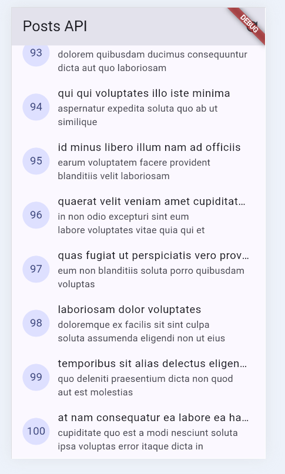 |

##### Halaman Detail

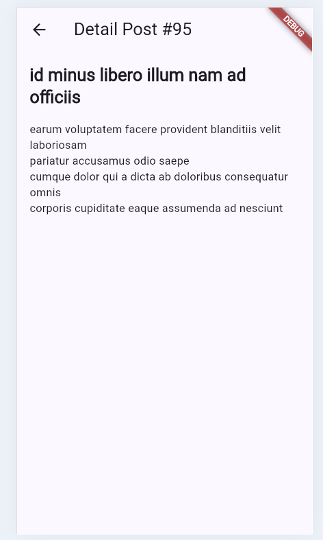

##### tampilan eror

##### Refleksi

*1. Mengapa UI dilarang memanggil Dio langsung? Apa yang rusak jika aturan ini dilanggar?*

Jawab : 

Karena memisahkan logika tampilan dan data (separation of concerns).

Dampak jika dilanggar: UI sulit diuji (unit test), logika API terduplikasi di banyak file, dan susah dipelihara jika ada perubahan API.

*2. Kapan pagination client-side cukup, dan kapan harus mengandalkan pagination server (_page/_limit)?*

Jawab :

Client-side: Cukup jika data sedikit (<100 item) dan jarang berubah.

Server-side: Wajib jika data besar atau dinamis agar hemat RAM, hemat kuota, dan scroll tetap mulus.

*3. Bagaimana exception repository berubah menjadi AsyncError tanpa try/catch di setiap widget? Kapan try/catch eksplisit tetap dibutuhkan?*

Jawab : 

Mekanisme: Riverpod otomatis menangkap error di Provider dan membungkusnya menjadi AsyncError untuk ditangani UI via .when().

try/catch eksplisit: Tetap dibutuhkan saat penanganan aksi tombol (submit form, refresh, atau memicu SnackBar) agar tidak merusak tampilan utama.

*4. Bagian mana dari hasil AI yang Anda perbaiki, dan mengapa?*

Jawab :

Import Bentrok: Menghapus duplikasi friendlyErrorMessage di providers.dart untuk menyelesaikan ambiguous import.

Unit Testing: Menggunakan FakePostRepository agar pengujian tidak melakukan HTTP request asli saat menjalankan flutter test.

