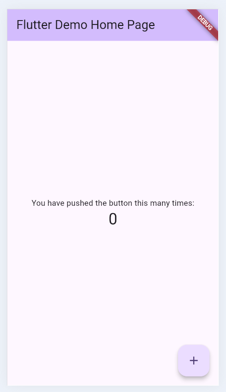
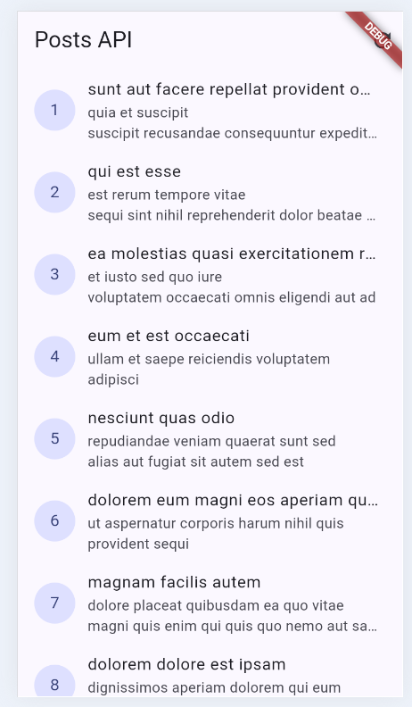
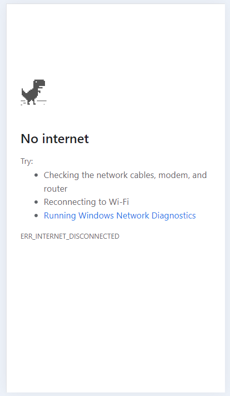
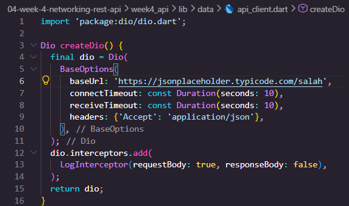
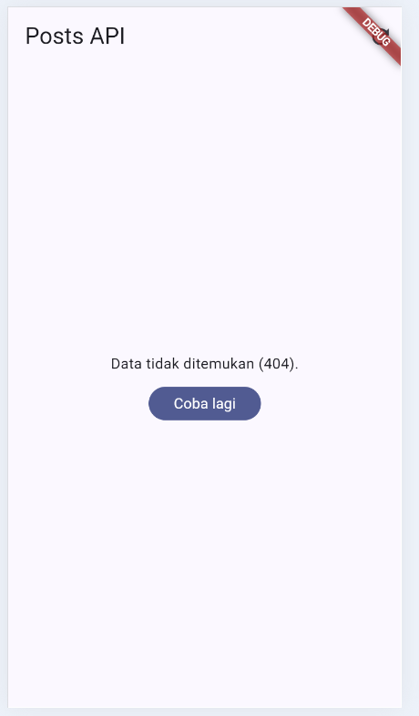
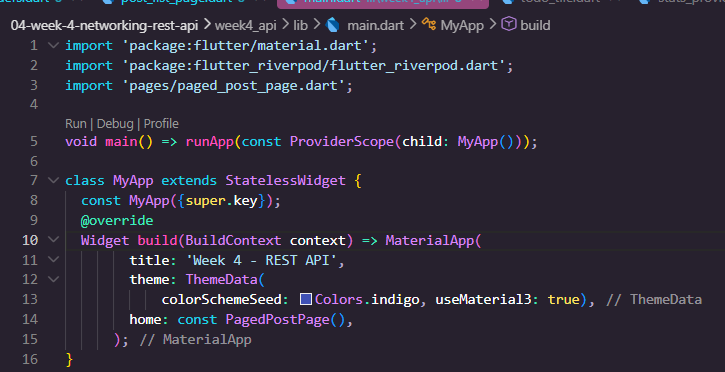
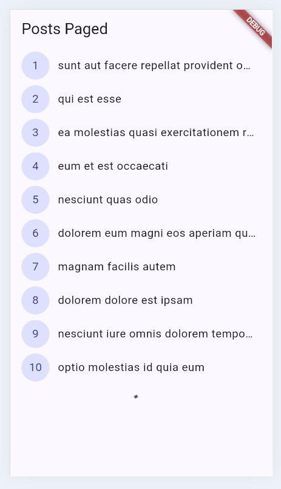

|  | Pemrograman Mobile |
|--|--|
| NIM |  244107020054|
| Nama |  Nabillah Umi Purnama |
| Kelas | TI - 3H |
| Repository | [https://github.com/nabillahumi/244107020054-mobile-course] () |

# WEEK 4
## Networking & REST API

Berikut merupakan hasil running:

### Praktikum 1: Dio dan model data

#### Tampilan awal week_navigation:

### Praktikum 2: Provider dan error handling

#### Uji tiga skenario error

*1. Jalankan aplikasi dengan internet normal, amati loading lalu daftar 100 posts.*

|                Daftar                |                 Daftar 100                 |
| :-------------------------------------: | :-----------------------------------------: |
|  |  |

*2. Matikan internet (mode pesawat), tekan refresh, amati pesan ramah + tombol Coba lagi. Nyalakan kembali internet, tekan Coba lagi.*

*3. Sementara ubah baseUrl menjadi URL salah, amati pesan error koneksi. Kembalikan setelah uji.*

|                Kode                |                 Hasil                |
| :-------------------------------------: | :-----------------------------------------: |
|  |  |

### Praktikum 3: Pagination dasar

|                Kode                |                 Hasil                |
| :-------------------------------------: | :-----------------------------------------: |
|  |  |

#### AI Challenge

##### AI Prompt Challenge

##### AI Verification Checklist

Sebelum kode AI diterima, verifikasi hal berikut dan catat temuan Anda di README:

*1. Apakah UI memanggil Dio secara langsung (dilarang) atau lewat repository?*

*2. Apakah fromJson aman null, atau masih memakai cast langsung yang bisa crash?*

*3. Apakah semua tipe DioExceptionType (timeout, connectionError, badResponse) dipetakan ke pesan pengguna?*

*4. Apakah baseUrl/timeout terpusat di satu client, bukan tersebar di tiap method?*

*5. Apakah test AI benar-benar menguji kasus field hilang, atau hanya happy path? Tambahkan minimal 1 edge case sendiri.*

*6. Jalankan flutter analyze dan flutter test, apakah hasil AI lolos tanpa warning?*