|  | Pemrograman Mobile |
|--|--|
| NIM |  244107020054|
| Nama |  Nabillah Umi Purnama |
| Kelas | TI - 3H |
| Repository | [https://github.com/nabillahumi/244107020054-mobile-course] () |

# WEEK 4
## Local Storage & Offline First

Berikut merupakan hasil running:

## Praktikum 1: SharedPreferences

#### Tampilan awal week_navigation:


|        Kode Setting_page.dart 1             |          Kode Setting_page.dart 2           |
| :-------------------------------------:     | :-----------------------------------------: |
|  |  |

#### Kode main.dart:


|           Tampilan mode terang            |            Tampilan mode gelap             |
| :-------------------------------------:   | :-----------------------------------------: |
|  |  |

## Praktikum 2: SQLite dan repository catatan

#### Kode mode offline

|         Kode note_page.dart 1             |         Kode note_page.dart 2            |
| :-------------------------------------:   | :-----------------------------------------: |
|  |  |

|         Kode note_page.dart 3             |         Kode note_page.dart 4            |
| :-------------------------------------:   | :-----------------------------------------: |
|  |  |

#### Kode main.dart:


|            Tampilan Halaman            |             Tampilan Tambah Pesan             |              Tampilan Hasil Pesan         |   
| :-------------------------------------:   | :-----------------------------------------: | :-----------------------------------------: |
|  |  |   |

#### Mode Offline
 
|     Tambah pesan dalam mode pesawat         |               Badge angka 2                 |
| :-----------------------------------------:  | :-----------------------------------------: |
|  |       |

Catatan tetap tersimpan dan tidak hilang walau HP dalam mode pesawat.

Badge angka muncul sebagai penanda bahwa ada catatan yang belum tersinkron ke server.

## Praktikum 3 : Cache-first dan antrean sync

### 1. Cache-first read untuk data API
---

### Kode post_repository.dart

|       Kode post_repository.dart 1         |        Kode post_repository.dart 1        |
| :-------------------------------------:   | :-----------------------------------------: |
|  |  |

### 2. Sinkronisasi catatan kotor (dirty)
---

#### Kode note_repository.dart


Menghubungkan ke Tombol UI:

#### Kode note_page.dart


### 3. Simulasi offline yang deterministik
---

Selain mode pesawat sungguhan, sediakan toggle forceOffline pada provider agar demo dan testing tidak bergantung pada kondisi Wi-Fi kelas:

1. Matikan Wi-Fi / aktifkan mode pesawat, buka kembali aplikasi: catatan tetap tampil, badge dirty tetap akurat.


Aplikasi dijalankan dalam Mode Pesawat. Catatan tersimpan secara lokal di perangkat dengan status dirty (belum tersinkron). Hal ini dibuktikan dengan munculnya badge merah bernilai 2 pada ikon header kanan atas serta ikon awan offline di samping setiap catatan.

2. Nyalakan kembali koneksi, jalankan syncNotes: badge kembali ke 0.


Saat tombol Sync ditekan, fungsi syncNotes berhasil dijalankan yang ditandai dengan munculnya pemberitahuan SnackBar "Berhasil menyinkronkan 2 catatan!" dan hilangnya ikon awan offline pada daftar catatan

3. Tuliskan langkah dan hasil observasi Anda (screenshot sebelum/sesudah) ke folder screenshots/.


Badge angka merah pada header hilang total

## AI Challenge

### Peran AI pada codelab ini

### AI Prompt Challenge
---

Aplikasi Flutter Offline Notes: CRUD catatan + preferensi tema.
Bandingkan SharedPreferences, Hive, sqflite (SQLite), dan Drift
untuk dua kebutuhan ini. Requirements:
- Kriteria: kompleksitas query, kebutuhan relasi, reaktivitas (stream),
  type-safety, ukuran boilerplate, dan kemudahan testing.
- Beri rekomendasi final: mana untuk preferensi, mana untuk catatan,
  beserta alasannya dalam 1 tabel.
- Tunjukkan skema tabel/kotak untuk 1000+ catatan.
Jelaskan trade-off setiap pilihan.

| Pilihan | Kompleksitas query | Kebutuhan relasi | Reaktivitas (stream) | Type-safety | Ukuran boilerplate | Kemudahan testing | Rekomendasi untuk aplikasi ini dan alasannya |
|---|---|---|---|---|---|---|---|
| **SharedPreferences** | Sangat sederhana: key-value; tidak cocok untuk filter, sort, atau pagination | Tidak ada | Tidak menyediakan stream perubahan data yang kuat; perubahan biasanya dibaca ulang | Rendah sampai sedang; tipe dibatasi primitive dan perlu key manual | Sangat kecil | Sangat mudah; dapat memakai instance/prefix test | **Preferensi tema**. `dark_mode` dan `last_opened_at` hanya beberapa nilai sederhana, sehingga database relasional akan berlebihan. |
| **Hive** | Sederhana sampai sedang; query lebih terbatas dan sering dilakukan di level box | Relasi harus dimodelkan manual | Baik melalui listener/`ValueListenable`, tetapi pola stream query kompleks lebih terbatas | Sedang; adapter/model perlu dijaga, dan error tipe dapat muncul saat membaca data | Kecil sampai sedang | Mudah dan cepat untuk unit test box/repository | Alternatif ringan untuk catatan sederhana tanpa banyak filter atau relasi. Kurang ideal jika fitur pencarian, pagination, dan sinkronisasi terus berkembang. |
| **sqflite (SQLite)** | Kuat: SQL, indeks, filter, sort, pagination, dan transaksi | Baik; foreign key dan join tersedia, tetapi mapping dilakukan manual | Tidak native-reactive; perlu menghubungkan perubahan database ke Riverpod/`ChangeNotifier` sendiri | Rendah sampai sedang; hasil query berupa `Map<String, Object?>` dan raw SQL | Sedang; SQL, migration, mapping, dan repository ditulis manual | Mudah diuji dengan database sementara, tetapi perlu menguji SQL dan mapping | **Catatan saat ini**. Sudah dipakai aplikasi, cocok untuk 1000+ catatan, mendukung status `dirty`, transaksi, dan query efisien. |
| **Drift** | Kuat seperti SQLite, ditambah query Dart yang terstruktur | Baik; relasi, join, constraint, dan migration lebih terarah | **Sangat baik**; query dapat menghasilkan stream otomatis saat tabel berubah | **Tinggi**; tabel dan hasil query dibuat sebagai kode Dart yang di-generate | Sedang sampai besar; perlu generator, schema version, dan konfigurasi build | Baik; database dapat diuji dengan executor in-memory dan query terisolasi | **Pilihan jangka panjang untuk catatan**. Pilih Drift jika aplikasi akan menambah pencarian, kategori/tag, relasi, stream UI, dan sinkronisasi yang lebih kompleks. |

#### Trade-off setiap pilihan

- **SharedPreferences** unggul dalam kesederhanaan dan overhead kecil, tetapi bukan database. Data catatan akan sulit dicari, diurutkan, dipaginasi, atau dipulihkan secara atomik.
- **Hive** cepat dan nyaman untuk object sederhana serta offline-first, tetapi relasi, query gabungan, dan migrasi skema tidak sekuat SQLite. Box besar juga membutuhkan desain indeks dan pola akses yang disiplin.
- **sqflite** memberi kontrol penuh atas SQLite: transaksi, indeks, constraint, dan query yang matang. Trade-off-nya adalah raw SQL serta konversi `Map` ke model harus dirawat manual, dan stream perubahan perlu dibuat di lapisan aplikasi.
- **Drift** menambah boilerplate dan code generation, tetapi membayar biaya itu dengan query type-safe, migration yang lebih terstruktur, dan stream reaktif. Ini paling nyaman ketika UI harus otomatis berubah setelah insert, update, atau delete.

#### Skema untuk 1000+ catatan

Untuk 1000+ catatan, setiap catatan disimpan sebagai satu baris, bukan seluruh daftar sebagai satu nilai JSON. Struktur minimal yang dipakai aplikasi adalah:

```text
+----------------------+
| notes                |
+----------------------+
| PK id INTEGER       |
| title TEXT NOT NULL |
| body TEXT NOT NULL  |
| updated_at TEXT     |
| dirty INTEGER       |
+----------------------+
					|
					| 0..n catatan belum tersinkron
					v
		 dirty = 1

+----------------------+
| cached_posts         |
+----------------------+
| PK id INTEGER       |
| payload TEXT        |
| cached_at TEXT      |
+----------------------+
```

SQL yang disarankan untuk menjaga performa daftar, pencarian waktu, dan antrean sinkronisasi:

```sql
CREATE TABLE notes (
	id INTEGER PRIMARY KEY AUTOINCREMENT,
	title TEXT NOT NULL,
	body TEXT NOT NULL DEFAULT '',
	updated_at TEXT NOT NULL,
	dirty INTEGER NOT NULL DEFAULT 0 CHECK (dirty IN (0, 1))
);

CREATE INDEX idx_notes_updated_at ON notes(updated_at DESC);
CREATE INDEX idx_notes_dirty ON notes(dirty) WHERE dirty = 1;
```

Contoh query tidak perlu memuat 1000+ baris sekaligus:

```sql
SELECT id, title, body, updated_at, dirty
FROM notes
ORDER BY updated_at DESC
LIMIT 50 OFFSET 0;
```

Dengan skema ini, SQLite sudah memadai untuk aplikasi sekarang. Untuk versi yang lebih besar, tabel yang sama dapat dimigrasikan ke Drift tanpa mengubah konsep penyimpanan; Drift menambahkan model Dart, query type-safe, dan `watch()` untuk stream daftar catatan.

### AI Verification Checklist
---

Sebelum rekomendasi AI diterima, verifikasi dan catat temuan Anda di README:

1. [✓] Apakah AI menempatkan daftar catatan di SharedPreferences? (menolak: rapuh untuk koleksi).

Copilot menggunakan SharedPreferences hanya untuk menyimpan preferensi tema (dark_mode). Hal ini sudah tepat karena SharedPreferences bukan database dan tidak cocok untuk filter atau pagination data catatan.

2. [✓] Apakah skema AI mendukung antrean sync (dirty flag / updated_at) atau hanya CRUD polos?

Skema database sudah memiliki dirty untuk menandai data yang perlu di-sync dan updated_at untuk membantu menangani konflik dengan metode Last-Write-Wins (LWW).

3. [✓] Apakah klaim "real-time" AI didukung stream (Drift/watch) atau hanya asumsi?

Evaluasi reaktivitas sudah tepat. sqflite tidak memiliki stream reaktif bawaan, sedangkan Drift menyediakan watch() untuk memantau perubahan data secara reaktif.

4. [✓] Apakah estimasi boilerplate AI masuk akal setelah Anda mencoba instalasinya (flutter pub add + migrasi skema)?

Tingkat kerumitan juga sudah sesuai: SharedPreferences paling sederhana, sqflite sedang karena membutuhkan mapping manual, dan Drift lebih kompleks karena menggunakan build_runner serta code generation.

5. Keputusan final Anda beserta alasannya, boleh berbeda dari rekomendasi AI selama berargumen.

Untuk menyimpan preferensi tema, `SharedPreferences` lebih tepat karena hanya digunakan untuk menyimpan satu data boolean seperti `dark_mode`, sehingga penggunaan SQLite akan terlalu berlebihan. Sedangkan untuk penyimpanan catatan, `sqflite` lebih sesuai karena mampu menangani 1000+ data di penyimpanan, mendukung *indexing*, serta mudah ditambahkan kolom `dirty` dan `updated_at` untuk kebutuhan *sync*. `SharedPreferences` kurang cocok untuk data dalam jumlah besar karena dapat memengaruhi kinerja aplikasi, sementara `Drift` memiliki implementasi yang lebih kompleks karena membutuhkan `build_runner` dan *code generation*.

#### Perbaikan
---

Perbaikan utama adalah mengubah id INTEGER AUTOINCREMENT menjadi id TEXT PRIMARY KEY dengan UUID v4. ID angka dapat mengalami collision ketika beberapa perangkat membuat data secara offline. UUID membuat setiap data memiliki ID unik sehingga lebih aman saat proses sync.

```sql
CREATE TABLE notes (
    id TEXT PRIMARY KEY NOT NULL, -- Menggunakan String UUID v4
    title TEXT NOT NULL,
    body TEXT NOT NULL DEFAULT '',
    updated_at TEXT NOT NULL,
    dirty INTEGER NOT NULL DEFAULT 1 CHECK (dirty IN (0, 1))
);

-- Indexing tetap dipertahankan
CREATE INDEX idx_notes_updated_at ON notes(updated_at DESC);
CREATE INDEX idx_notes_dirty ON notes(dirty) WHERE dirty = 1;
```

## Refactoring, testing, dan error umum

### Refactoring Challenge

Lakukan refactoring berikut pada project catatan Anda, lalu commit dengan pesan yang jelas:

1. Ekstrak baris catatan menjadi widget NoteTile tersendiri yang menampilkan badge "belum tersinkron" bila dirty == true.
---

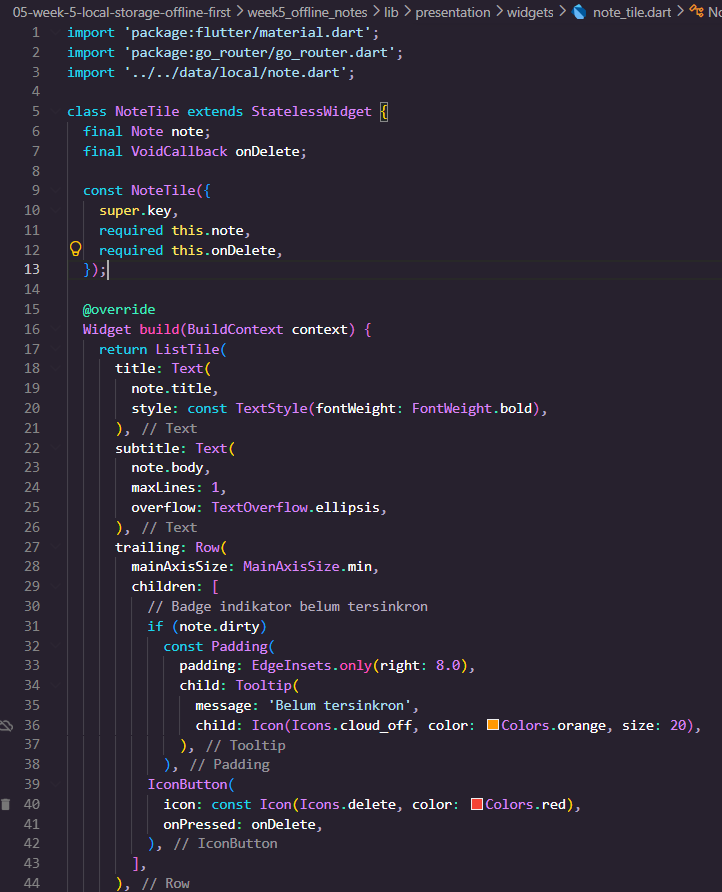

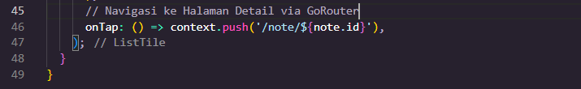

2. Pindahkan logika cache posts dan syncNotes ke file lib/data/sync.dart agar repository tetap fokus pada CRUD.
---

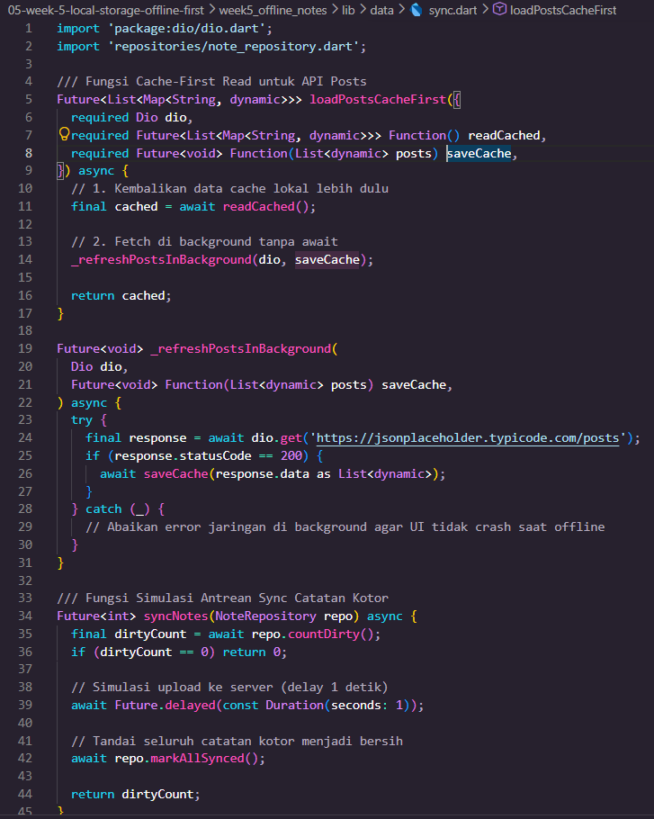

3. Tambahkan halaman detail catatan dengan GoRouter (/note/:id) yang membaca dari repository lokal, bukan dari state halaman list.
---

#### Tampilan Detail Catatan

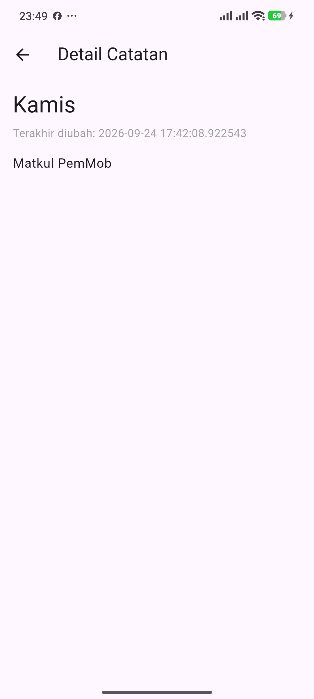

#### Kode Main Kode note_detail.dart 

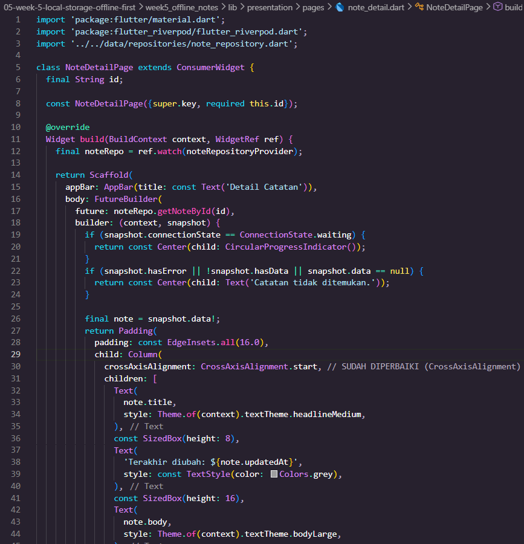   

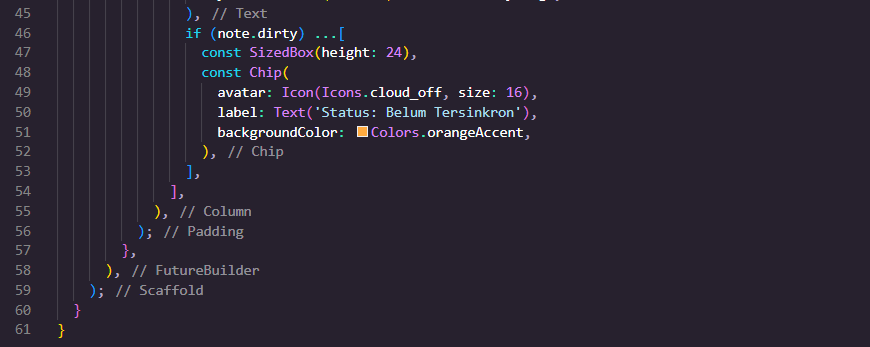

#### Kode Main

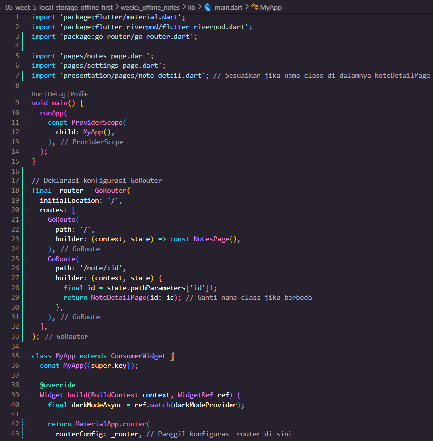

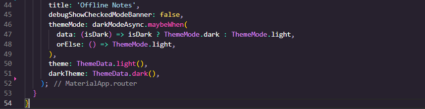

#### Kode note_repository.dart

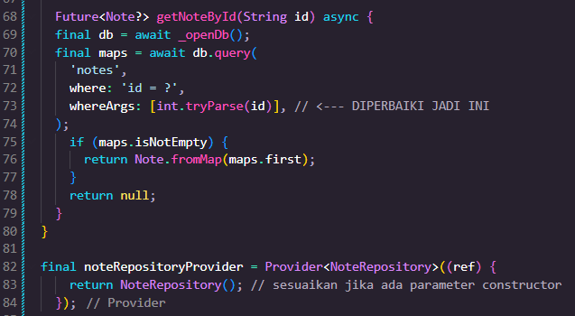

#### Kode note_page.dart

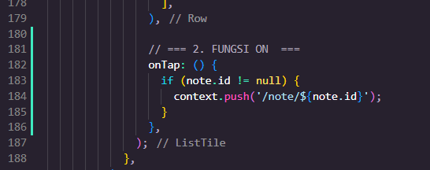

### Testing: unit test model + repository palsu
---

Buat test/note_test.dart. Uji mapping aman null dan provider dengan repository palsu (tanpa SQLite sungguhan):

#### Kode Main Kode note_test.dart 

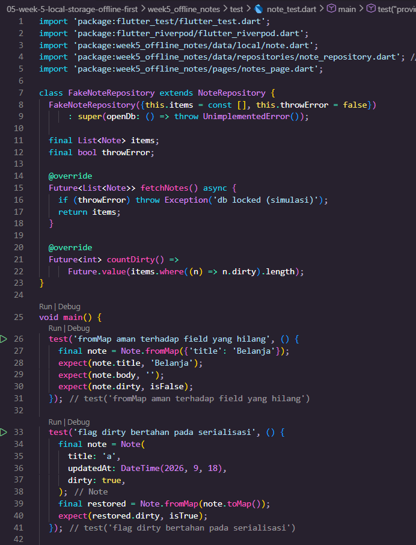   

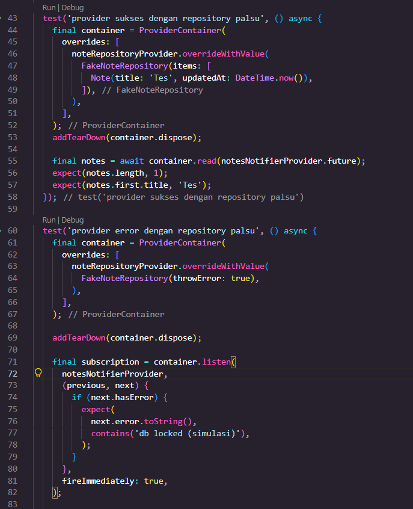

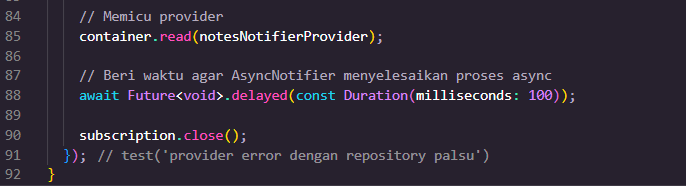

#### Fitur Analyze

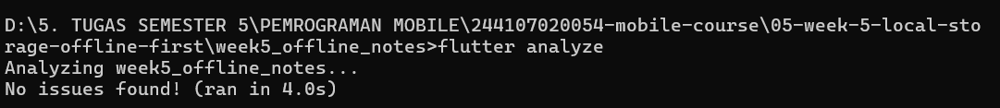

#### Flutter Tes
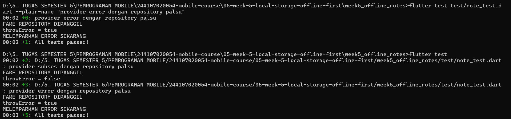


### Checklist verifikasi mandiri
---

1. [✓] UI tidak memanggil SQLite/SharedPreferences langsung; semua lewat repository + provider.

dirtyCountProvider. Proses penyimpanan dan pengambilan data dilakukan melalui NoteRepository, sehingga UI tidak mengakses SQLite atau SharedPreferences secara langsung.

2. [✓] Aplikasi penuh berfungsi dalam mode pesawat: baca, tambah, hapus catatan.

Data catatan disimpan secara lokal menggunakan SQLite, sehingga fitur membaca, menambah, dan menghapus catatan tetap dapat digunakan meskipun perangkat tidak memiliki koneksi internet.

3. [✓] Badge dirty akurat sebelum/sesudah sync; cache posts tampil tanpa internet.

Badge dirty mengambil jumlah data yang memiliki status dirty melalui dirtyCountProvider. Setelah proses sinkronisasi selesai, data ditandai sebagai sudah tersinkron sehingga jumlah pada badge diperbarui. Data yang telah tersimpan di lokal juga tetap dapat ditampilkan ketika tidak ada koneksi internet.

4. [✓] flutter analyze tanpa issue dan semua test lulus.

Hasil pengujian menunjukkan seluruh 5 test berhasil, ditandai dengan output +5: All tests passed!. Selain itu, flutter analyze digunakan untuk memastikan tidak terdapat masalah pada kode sebelum aplikasi dikumpulkan.

5. [✓] Hasil AI diverifikasi dan didokumentasikan pada folder docs/.

Hasil yang diperoleh dari bantuan AI tidak langsung digunakan tanpa pemeriksaan. Hasil tersebut diverifikasi dengan menjalankan aplikasi dan pengujian, kemudian dokumentasi hasil verifikasi disimpan pada README.md sebagai bukti pengerjaan.

## Tugas, refleksi, dan referensi**

### Mini project / Industry Challenge
---

Bangun aplikasi Offline Notes sebagai tugas minggu ini (kembangkan project codelab atau buat baru):

1. Preferensi: toggle tema gelap/terang + waktu terakhir dibuka via SharedPreferences.

2. CRUD catatan persisten via SQLite (sqflite) melalui repository lokal + Riverpod; daftar diurutkan updated_at terbaru.

3. Offline-first: cache-first untuk data bacaan, dirty flag + syncNotes untuk tulisan, dan aturan konflik eksplisit yang didokumentasikan.

4. Buktikan mode pesawat: screenshot daftar catatan saat offline dan badge dirty sebelum/sesudah sync.

5. Sertakan minimal 2 test yang lulus (1 unit test model + 1 test provider dengan repository palsu).

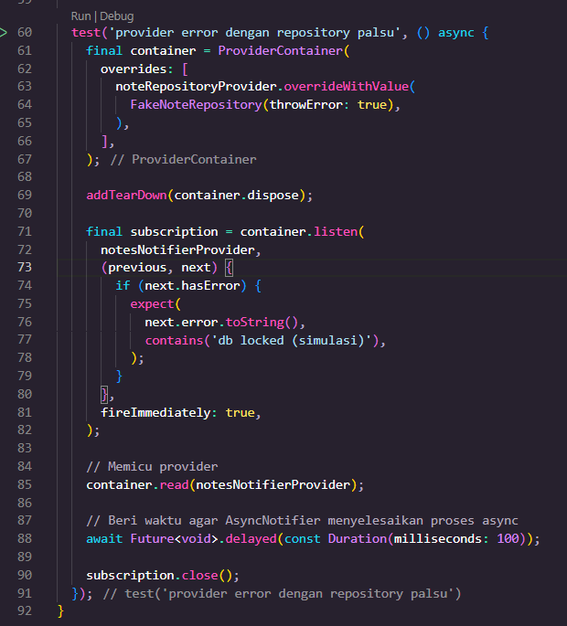


6. Kerjakan bagian AI Challenge dan dokumentasikan prompt, tabel perbandingan storage, keputusan final, serta alasan teknis Anda di docs/.

7. Push ke repository portfolio pada folder 05-week-5-local-storage-offline-first/ dengan struktur lib/, test/, docs/, README.md, dan screenshots/. README menjelaskan tujuan, fitur utama, stack teknologi, cara menjalankan, dan hasil yang dicapai.


|           Tampilan mode terang            |            Tampilan mode gelap             |
| :-------------------------------------:   | :-----------------------------------------: |
|  |  |

|            Tampilan Halaman            |             Tampilan Tambah Pesan             |              Tampilan Hasil Pesan         |   
| :-------------------------------------:   | :-----------------------------------------: | :-----------------------------------------: |
|  |  |   |

|     Tambah pesan dalam mode pesawat       |                  Badge 2                    |
| :-------------------------------------:   | :-----------------------------------------: |
|  |  |

|             Berhasil singkron             |            Badge berubah jadi 0             |
| :-------------------------------------:   | :-----------------------------------------: |
|  |  |


### Refleksi
---

*1. Mengapa daftar catatan tidak boleh disimpan di SharedPreferences? Apa yang rusak jika aturan ini dilanggar?*

Jawab :

Karena SharedPreferences lebih cocok untuk menyimpan data sederhana seperti pilihan tema atau status tertentu. Kalau digunakan untuk menyimpan banyak catatan, semua data harus dibaca dan disimpan kembali sekaligus. Selain kurang efisien, pencarian dan pengurutan data juga menjadi lebih sulit. Karena itu, data catatan lebih tepat menggunakan SQLite.

*2. Kapan cache-first cukup, dan kapan Anda membutuhkan strategi lain (misalnya network-first untuk data harga real-time)?*

Jawab :

Sedangkan untuk data yang sering berubah dan harus terbaru, seperti harga atau stok, lebih cocok menggunakan network-first agar aplikasi mencoba mengambil data dari server terlebih dahulu.

*3. Bagaimana dirty flag berubah menjadi antrean sync tanpa memblokir UI? Kapan antrean terpisah (tabel outbox) menjadi perlu?*

Jawab :

Saat catatan diubah ketika offline, data langsung disimpan ke database lokal dan diberi dirty = 1. Jadi pengguna tidak perlu menunggu proses sinkronisasi. Jika operasi yang harus disinkronkan semakin banyak dan perlu menyimpan urutan setiap perubahan, barulah tabel Outbox lebih diperlukan.

*4. Bagian mana dari rekomendasi AI yang Anda tolak, dan mengapa?*

Jawab :

Saya tidak menggunakan rekomendasi untuk menambahkan package atau mengubah struktur database karena kebutuhan aplikasi masih sederhana. Saya memilih tetap menggunakan sqflite karena sudah cukup untuk CRUD catatan dan lebih mudah diterapkan pada project ini.