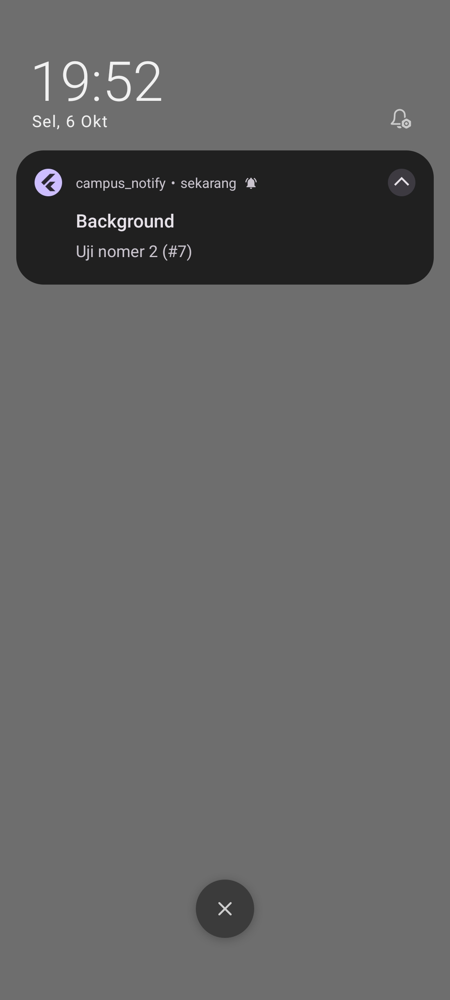
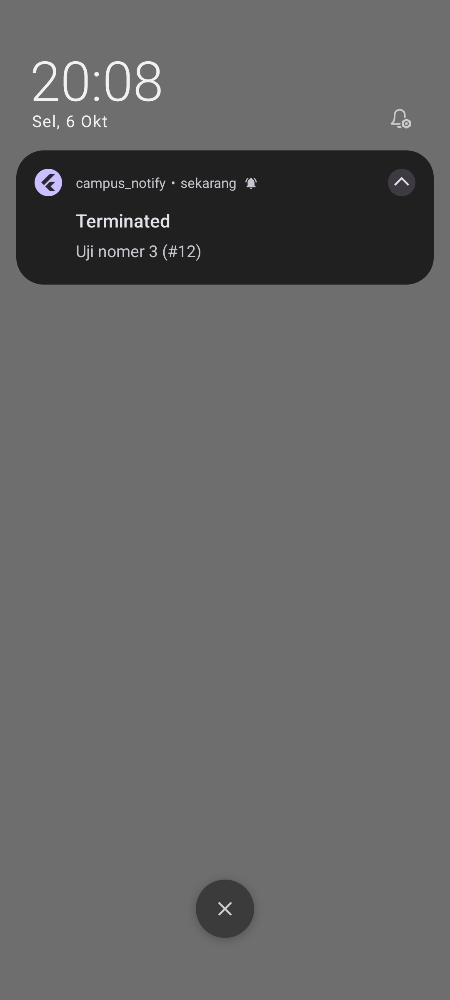

|  | Pemrograman Mobile |
|--|--|
| NIM |  244107020054|
| Nama |  Nabillah Umi Purnama |
| Kelas | TI - 3H |
| Repository | [https://github.com/nabillahumi/244107020054-mobile-course] () |

# WEEK 6
## Authentication, Security & FCM

Berikut merupakan hasil running:

## Praktikum 1: Login + secure storage + token refresh

### Tampilan awal week_navigation:

|                 Halaman login               |            Password Salah             |
| :-------------------------------------:     | :-----------------------------------: |
|  |  |

|          Halaman Utama              |            Halaman Pengumuman             |
| :--------------------------------:  | :---------------------------------------: |
|  |  |

### Tambahan kode:

### Kode push_service.dart :

### Kode announcement_page.dart :

### Kode home_page.dart :

### Kode login_page.dart :

|               kode login 1               |                Kode login 2                |
| :-------------------------------------:  | :-----------------------------------------: |
|  |  |

## Praktikum 2: FCM, permission, dan token lifecycle

### Daftarkan aplikasi ke Firebase

1. Buat project di Firebase Console, tambahkan aplikasi Android dengan package name sesuai applicationId Anda.

2. Unduh google-services.json ke android/app/ dan ikuti panduan FCM Flutter client (terapkan plugin google-services dan dependensi). Untuk iOS tambahkan GoogleService-Info.plist.

### Kode Google Service 

|     kode android/app/build.gradle.kts      |       kode android/build.gradle.kts         |
| :---------------------------------------:  | :-----------------------------------------: |
|  |  |

3. Pastikan firebase_core diinisialisasi sebelum runApp: await Firebase.initializeApp().

## Hasil Praktikum 2

### Uji kirim pertama dari Firebase Console

Halaman Debug di HP kamu yang menampilkan token terpotong yang baru.

|           Hasil token awal          |          Hasil token baru            |
| :--------------------------------:  | :----------------------------------: |
|  |  |

1. Buka Firebase Console -> Messaging -> buat campaign notifikasi percobaan.

2. Masukkan title dan body, targetkan aplikasi Android Anda.

3. Kirim saat aplikasi dalam state background: banner sistem harus muncul. Klik banner: aplikasi terbuka.

setelah mengklik notifikasi tersebut langsung aplikasi terbuka

## Praktikum 3: Payload, tiga app state, klik dan topik

| State | Yang Diharapkan | Cara Uji | Status / Hasil |
| :--- | :--- | :--- | :---: |
| **Foreground** | Banner lokal muncul, klik masuk ke `/pengumuman/3` | Aplikasi terbuka di layar, kirim dari Firebase Console | Berhasil (Sesuai) |

Pengujian dilakukan saat aplikasi sedang terbuka (foreground). Notifikasi ditampilkan melalui local notification, kemudian ketika notifikasi diklik aplikasi mengarahkan pengguna ke halaman Pengumuman #3 melalui route /pengumuman/3.

|             Notifikasi              |    Tampilan Halaman Pengumuman 3     |
| :--------------------------------:  | :----------------------------------: |
|  |  |

| State | Yang Diharapkan | Cara Uji | Status / Hasil |
| :--- | :--- | :--- | :---: |
| **Background** | Banner sistem muncul, klik masuk ke rute yang benar | Tekan tombol Home, kirim dari Console, klik banner | Berhasil (Sesuai) |

Pengujian dilakukan saat aplikasi berada di background dengan menekan tombol Home tanpa menutup aplikasi. Notifikasi muncul pada sistem Android, kemudian ketika notifikasi diklik aplikasi terbuka dan mengarahkan pengguna ke halaman Pengumuman #7 melalui route /pengumuman/7.

|             Notifikasi              |    Tampilan Halaman Pengumuman 7     |
| :--------------------------------:  | :----------------------------------: |
|  |  |

| State | Yang Diharapkan | Cara Uji | Status / Hasil |
| :--- | :--- | :--- | :---: |
| **Terminated** | Aplikasi terbuka ke rute yang benar via `getInitialMessage` | Swipe-close aplikasi (kill app), kirim dari Console, klik banner | Berhasil (Sesuai) |

Pengujian dilakukan saat aplikasi sudah ditutup sepenuhnya. Setelah notifikasi dikirim dan diklik, aplikasi terbuka kembali dan menggunakan getInitialMessage() untuk mengambil data notifikasi, kemudian mengarahkan pengguna ke halaman Pengumuman #12 melalui route /pengumuman/12.

|             Notifikasi              |    Tampilan Halaman Pengumuman 12     |
| :--------------------------------:  | :----------------------------------: |
|  |  |

### Topic messaging

Aplikasi subscribe ke topic pengumuman-kampus untuk menerima notifikasi broadcast. Pengujian melalui Firebase Console berhasil mengirim notifikasi ke perangkat dan mengarahkan ke halaman pengumuman.

Hasil: Berhasil. Perangkat dapat menerima notifikasi yang dikirim melalui topic pengumuman-kampus.

|             Notifikasi              |             Target Topic             |    Tampilan Halaman Pengumuman 20   |
| :--------------------------------:  | :----------------------------------: |:----------------------------------: |
|  |  |  |

## AI Challenge

### AI Prompt Challenge

Hasil AI Challenge: Implementasi notifikasi berhasil dipertahankan dengan penambahan fungsi unsubscribe topic, penanganan permission Android 13+/iOS, serta dokumentasi bagian yang tidak menggunakan BuildContext. Fitur foreground, background, terminated, dan topic messaging tetap berjalan seperti sebelumnya.

### AI Verification Cheklist

Sebelum draf AI diterima, verifikasi dan catat temuan di README/docs:

1. [✓] Apakah background handler berupa fungsi top-level dengan @pragma('vm:entry-point')? (tolak jika berupa method kelas).

firebaseMessagingBackgroundHandler() berada di luar class dan menggunakan @pragma('vm:entry-point'), sehingga dapat dijalankan oleh Firebase pada isolate background.

2. [-] Apakah onTokenRefresh benar-benar mengirim token baru ke backend, bukan hanya dicetak ke log?

Kode saat ini sudah memiliki onTokenRefresh dan memperbarui token di aplikasi, tetapi belum mengirim token baru ke backend karena project kamu belum memiliki endpoint backend /devices. 

3. [✓] Apakah foreground memakai local notification manual? (tanpa ini banner tidak muncul saat aplikasi terbuka).

Saat aplikasi terbuka, FirebaseMessaging.onMessage menerima pesan lalu _local.show() digunakan untuk menampilkan notifikasi secara manual.

4. [✓] Apakah klik dari ketiga state (foreground/background/terminated) masuk ke rute yang benar? Buktikan dengan tabel pengujian.

Foreground menggunakan callback local notification, background menggunakan onMessageOpenedApp, dan terminated menggunakan getInitialMessage(). Ketiganya sudah diuji dan berhasil mengarah ke halaman pengumuman.

5. [✓] Apakah token/secret tidak di-hardcode dan tidak di-log penuh? Perbaiki bila AI melanggarnya.

Token tidak ditulis secara hardcode. Saat ditampilkan di log, token hanya menggunakan 12 karakter pertama lalu dipotong dengan ..., sehingga token lengkap tidak terekspos.

6. [✓] Keputusan final dan alasan teknis Anda, boleh berbeda dari saran AI selama berargumen.

Kode AI tidak digunakan seluruhnya. Beberapa bagian dipertahankan karena sudah sesuai, sedangkan bagian yang tidak sesuai kebutuhan project diperbaiki secara manual tanpa mengubah fitur yang sudah berhasil.